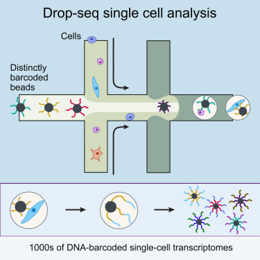

Note: the code of the first practical session is included here for the sake of
completeness. However, **you do not need to run this code again!** We have 
provided you with the preprocessed Macosko dataset (resulting object after 
session 1), which can be obtained in code lines 682-687 (where session 2 starts).

# Preamble: installation of Bioconductor libraries

```{r, eval=FALSE}
# install BiocManager package if not installed yet.
# BiocManager is the package installer for Bioconductor software.
if (!requireNamespace("BiocManager", quietly = TRUE))
    install.packages("BiocManager")

# install packages if not yet installed.
pkgs <- c("SingleCellExperiment",
          "ExperimentHub",
          "edgeR",
          "biomaRt",
          "DropletUtils", 
          "scRNAseq", 
          "scater", 
          "scuttle", 
          "scran",
          "scry",
          "BiocSingular", 
          "scDblFinder")
notInstalled <- pkgs[!pkgs %in% installed.packages()[,1]]
if(length(notInstalled) > 0){
  BiocManager::install(notInstalled)
}

# install from CRAN if not yet installed.
CRANpkgs <- c("Seurat",
              "PCAtools",
              "glmpca")
notInstalledCRAN <- CRANpkgs[!CRANpkgs %in% installed.packages()[,1]]
if(length(CRANpkgs) > 0){
  install.packages(CRANpkgs)
}
```

# The Macosko dataset

In this workshop session, we will analyze the single-cell RNA-seq dataset
from the publication by Macosko *et al.*, Cell 161, 1202–1214 from 2015
[(link)](https://doi.org/10.1016/j.cell.2015.05.002). This is the manuscript in
which the droplet scRNA-seq technology **Drop-seq** was introduced.
Six years after the original publication, drop-seq is still one of the most 
commonly adopted scRNA-seq protocols, as evidenced by the
large number of citations for Macosko *et al.* 
(4.303 citations at November 3, 2021).

The basic idea behind the Drop-seq protocol can be taken from the graphical
abstract of the publication.

```

```

The success of Drop-seq can be explained by the following advantageous 
features:

- The use of unique molecular identifiers (UMIs). By working with UMIs, one count
corresponds to one observed mRNA molecule present in the cell. Thanks to the use
of UMI barcodes, PCR artifacts are reduced.

- Scalability: microfluidics technology allows for performing the library prep
reactions inside nanodroplets, in which single cells may be contained. Library prep occurs across all droplets simultaneously.

- Cost: the experiment costs around 6.5 cents (USD) per cell.

- Speed: The very large dataset that we will be working with today was 
generated in an experiment that took only 4 days.

In this particular experiment, Macosko *et al.* sequenced 49,300 cells from the
mouse retina, identifying 39 transcriptionally distinct cell populations. The
experiment was performed in 7 batches.

# Data availability

## SRA

The [Sequence Read Archive (SRA)](https://www.ncbi.nlm.nih.gov/sra) is the 
largest publicly available repository of high-throughput sequencing data.
The data are stored by the National Center for Biotechnology Information (NCBI) 
services and multiple cloud storage providers. From this website "raw" 
sequencing data can be retrieved. In practice, these are usually `.sra` files,
which can be downloaded and converted into FASTQ files using functions
from the `sratoolkit` software. 

For our dataset, the FASTQ data can be retrieved from this 
[link](https://www.ncbi.nlm.nih.gov/Traces/study/?acc=PRJNA267857&o=acc_s%3Aa).
The data are stored as one file per sequencing batch, with each file 
approximately 20Gb. As such, it will be unfeasible to download and process these
FASTQ files in this practical session.

Instead, for demonstrative purposes, we have taken a subsample of the FASTQ
file for the first sequencing batch for you to work with. On this subsample, 
we may perform all the tasks that we would have performed on the full dataset.
The steps that are required for downloading and quantifying drop-seq data
can be found in [a Shell script on our companion GitHub repository](https://github.com/statOmics/singleCellCourse/blob/master/lab1_preprocessing/preprocessDropseq.sh).

## GEO

The dataset from Macosko *et al.* was also uploaded by the authors on the 
Gene Expression Omnibus (GEO) platform under accession number 
[GSE63472](https://www.ncbi.nlm.nih.gov/geo/query/acc.cgi?acc=GSE63472), 
from which raw and readily-processed data files may be retrieved, including:

1. *GSE63472_RAW.tar*, a 90.6Gb object that contains the "raw data" for the
experiment. In the scRNA-seq context, FASTQ files are often considered the raw
data format.

2. *GSE63472_P14Retina_merged_digital_expression.txt.gz*, a 50.7Mb matrix that
stores the gene expression values for each cell. These values are integer 
counts, that did not undergo any type of preprocessing or normalization.

3. *GSE63472_mm10_reference_metadata.tar.gz*, a 862.9Mb compressed folder
containing information on the reference genome to which the scRNA-seq reads
were aligned (see theory slides).

4. *GSE63472_P14Retina_logDGE.txt.gz*, a 316.8Mb compressed text file, not clear
what it contains (results from a differential gene expression analysis, but
with log-transformation, so log-fold changes maybe?).

As such, by downloading *GSE63472_P14Retina_merged_digital_expression.txt.gz*,
we avoid re-quantifying the data, i.e., the translation from reads from the
FASTQ files into a gene-level expression values for each cell. 

One issue that often arises from data downloaded from GEO, is that there is no
strict requirements for which data should be included in the upload by the 
authors. As such, from my personal experience, it can often be the case that
important information like metadata are missing, or the content of the submitted
files is unclear. Even if all the required data are available, as is the case 
here, we would still need to piece all the information together from different 
files and file formats before we can use them.

## ExperimentHub

The Bioconductor *ExperimentHub* web resource, which can be accessed using the 
[ExperimentHub](https://bioconductor.org/packages/release/bioc/html/ExperimentHub.html) 
R package, provides a central location where curated data from experiments, 
publications or training courses can be accessed. While it contains far less
datasets than the SRA or GEO (4965 records to date), these datasets all follow 
the tidy data format of Bioconductor. Note that the ExperimentHub contains 
several types of data, like bulk and single-cell transcriptomics data, 
microarrays and more.

The Macosko dataset is available from ExperimentHub and can be accessed as
follows:

```{r, message=FALSE, warning=FALSE}
library(ExperimentHub)
edb <- ExperimentHub()

edb[grep("Macosko", edb$title)] # find accession number (can be inefficient)

edb_counts <- edb[["EH2690"]]
edb_counts[1:5,1:5]

edb_coldata <- edb[["EH2691"]]
edb_coldata[1:5,]

rm(edb, edb_counts, edb_coldata)
```

## scRNASeq

In addition to ExperimentHub, Bioconductor provides the package
[scRNAseq](https://bioconductor.org/packages/release/data/experiment/html/scRNAseq.html).
This package provides an even more user-friendly client to access (only) 
scRNA-seq datasets from the ExperimentHub web resource. Data retrieved using the
scRNAseq package are stored as user-friendly `SingleCellExperiment` objects, 
with the expression data, gene-level information, cell-level information and 
experiment metadata all in place in one data object. The scRNA-seq package
currently holds 61 datasets, including the data from *Macosko et al.*:

```{r, message=FALSE, warning=FALSE}
library(scRNAseq)
scRNAseq::MacoskoRetinaData()
```

# Import data

The `scRNAseq` package provides convenient access to several datasets. See the [package Bioconductor page](http://bioconductor.org/packages/release/data/experiment/html/scRNAseq.html) 
for more information.

```{r}
# Code below might ask you to create an ExperimentHub directory. 
# Type 'yes' and hit Enter, to allow this.
suppressPackageStartupMessages(library(scRNAseq))
sce <- MacoskoRetinaData()
```

# A `SingleCellExperiment` object

```{r}
sce
```

## Accessing data from a `SingleCellExperiment` object

Please see [Figure 4.1 in OSCA](http://bioconductor.org/books/release/OSCA/data-infrastructure.html) 
for an overview of a `SingleCellExperiment` object.

```{r}
# Data: assays
assays(sce)
assays(sce)$counts[1:5, 1:5]

# Feature metadata: rowData
rowData(sce) # empty for now

# Cell metadata: colData
colData(sce)

# Reduced dimensions: reducedDims
reducedDims(sce) # empty for now
```

## Creating a new `SingleCellExperiment` object

```{r}
sceNew <- SingleCellExperiment(assays = list(counts = assays(sce)$counts))
sceNew

rm(sceNew)
```

## Storing (meta)data in a `SingleCellExperiment` object

```{r}
fakeGeneNames <- paste0("gene", 1:nrow(sce))
rowData(sce)$fakeName <- fakeGeneNames
head(rowData(sce))
# Remove again by setting to NULL
rowData(sce)$fakeName <- NULL

assays(sce)$logCounts <- log1p(assays(sce)$counts)
assays(sce)
assays(sce)$logCounts[1:5, 1:5]
assays(sce)$logCounts <- NULL
```

# Obtaining and including rowData

The `rowData` slot of a `SingleCellExperiment` object allows for storing 
information on the features, i.e. the genes, in a dataset. In our object,
the `rowData` slot is empty.

```{r}
rowData(sce)
```

As such, the only information we have on the genes are their names, which can
be retrieved as the `rownames` of the expression matrix.

```{r}
head(rownames(sce))
```

These are the gene names (symbols). Note that it may be useful to include 
additional information in the `rowData` slot. For instance, we may want to 
store:

- Unambiguous gene identifiers (e.g. from ENSEMBL)
- On which chromosome the gene is located
- Gene length (genomic start position and end position)
- Others...

```{r, message=FALSE, warning=FALSE}
library("biomaRt")

ensembl75 <- useEnsembl(biomart = 'genes', 
                        dataset = 'mmusculus_gene_ensembl',
                        version = 75)

head(listAttributes(ensembl75)) # potential info to extract

geneInfo <- getBM(attributes = c("ensembl_gene_id", # ENSEMBL unambiguous identifier
                                 "mgi_symbol", # Gene symbol (to link with SCE rownames),
                                 "chromosome_name", # On which chromosome
                                 "start_position", # Start position
                                 "end_position"),# End position
                  mart = ensembl75)

head(geneInfo)
```

```{r}
geneInfo$mgi_symbol_upper <- toupper(geneInfo$mgi_symbol) 
# match between gene info and rownames

sum(rownames(sce) %in% geneInfo$mgi_symbol_upper)
sum(!rownames(sce) %in% geneInfo$mgi_symbol_upper) # lost in conversion :(

rowData(sce) <- geneInfo[match(rownames(sce),geneInfo$mgi_symbol_upper),]
```

```{r}
head(rowData(sce))
```

# Filtering non-informative genes

```{r}
library(edgeR)

# A very simple strategy: remove all genes that are expressed in less than 10
# out of 49300 cells -> note that this a very lenient filtering criterium
keep <- rowSums(assays(sce)$counts > 0) > 10
table(keep)

sce <- sce[keep,]
```

Note that dedicated functions for filtering out lowly expressed genes exist.
One such function is the `filterByExpr` function of the edgeR R package.
In brief, the strategy keeps genes that have at least "min.count" reads in a 
worthwhile number samples. 

More precisely, the filtering keeps genes that have count-per-million (CPM) 
above k in n samples. 

k is determined by the min.count argument to the function, and by the sample 
library sizes.

n is determined by the design matrix. n can be seen as the smallest group sample
size. A `group` of samples/cells can be defined as cells that are more similar
to one another, e.g., from the same sequencing batch, the same patient....
Here we could also use the cluster assignment (cell type) for each cell as the
grouping variable; *note however, that this usually is not available until a*
*later stage in the analysis pipeline* (i.e., after dimension reduction and 
clustering, topics we will cover next session.)

If all the group sizes are larger than the `large.n` argument of the 
filterByExpr function, which defaults to 10, then n will be taken as
`min.prop`* the the number of samples/cells in the smallest group.

Note that all the group sizes will often be larger than the `large.n` in case
of single-cell data.

```{r}
# Slow (more than 1min) -> do not run
# keep2 <- filterByExpr(sce,
#                       group = sce$cluster,
#                       min.count = 1,
#                       min.total.count = 15,
#                       min.prop = 0.2)
# table(keep2)
```


# Quality control

In quality control (QC), we check the quality of our dataset. In particular, 
we investigate undesirable oddities, such as low-quality cells, empty droplets
or doublets.

## Identifying and removing low-quality cells

There are several distinguishing features of low-quality cells that can be used
in order to identify them. [As described in the OSCA book](http://bioconductor.org/books/3.14/OSCA.basic/quality-control.html) 
book):

1. The library size is defined as the total sum of counts across all 
relevant features for each cell. Here, we will consider the relevant features 
to be the endogenous genes. Cells with small library sizes are of low quality 
as the RNA has been lost at some point during library preparation, either due 
to cell lysis or inefficient cDNA capture and amplification.

2. The number of expressed features in each cell is defined as the number of 
endogenous genes with non-zero counts for that cell. Any cell with very 
few expressed genes is likely to be of poor quality as the diverse transcript 
population has not been successfully captured.

3. We sometimes have spike-in (ERCC) transcripts available.
The proportion of reads mapped to spike-in transcripts is calculated relative 
to the total count across all features (including spike-ins) for each cell. 
As the same amount of spike-in RNA should have been added to each cell, 
any enrichment in spike-in counts is symptomatic of loss of endogenous RNA.

4. In the absence of spike-in transcripts, the proportion of reads mapped 
to genes in the mitochondrial genome can be used. High proportions are 
indicative of poor-quality cells (Islam et al. 2014; Ilicic et al. 2016), 
presumably because of loss of cytoplasmic RNA from perforated cells. 
The reasoning is that, in the presence of modest damage, the holes in the 
cell membrane permit efflux of individual transcript molecules but are too 
small to allow mitochondria to escape, leading to a relative enrichment of 
mitochondrial transcripts. For single-nuclei RNA-seq experiments, high 
proportions are also useful as they can mark cells where the cytoplasm has 
not been successfully stripped.

## Calculate QC variables

This function calculates useful QC metrics for identification and removal of 
potentially problematic cells. Default per-cell metrics are the sum of counts 
(i.e., the library size) and the number of detected features. The percentage of 
counts in the top features also provides a measure of library complexity.

If subsets is specified, these statistics are also computed for each subset of 
features. This is useful for investigating gene sets of interest, e.g., 
mitochondrial genes.

```{r, message=FALSE, warning=FALSE}
library(scater)

# check ERCC spike-in transcripts
sum(grepl("^ERCC-", rownames(sce))) # no spike-in transcripts available

# check mitochondrial genes
sum(rowData(sce)$chromosome_name=="MT",na.rm = TRUE) # 28 mitochondrial genes
sum(grepl("^MT-", rownames(sce))) # alternatively
is.mito <- grepl("^MT-", rownames(sce))

## calculate QC metrics
df <- perCellQCMetrics(sce, subsets=list(Mito=is.mito))
head(df)

# add QC variables to sce object
colData(sce) <- cbind(colData(sce), df)

# the QC variables have now been added to the colData of our SCE object.
head(colData(sce))
```

## Exploratory data analysis

In the figure below, we see that several cells have a very low number of 
expressed genes, and where most of the molecules are derived from 
mitochondrial genes. This indicates likely damaged cells, presumably because 
of loss of cytoplasmic RNA from perforated cells, so we should remove these for 
the downstream analysis.

```
# Number of genes vs library size
plotColData(sce, x = "sum", y="detected", colour_by="cluster") 

# Mitochondrial genes
plotColData(sce, x = "detected", y="subsets_Mito_percent")
```

## QC using adaptive thresholds

Below, we remove cells that are outlying with respect to

 1. A low sequencing depth (number of UMIs);
 2. A low number of genes detected;
 3. A high percentage of reads from mitochondrial genes.
 
 Here we will remove cells for QC based on **adaptive thresholds** related to
 the three points from above. Adaptive trhesholds are used as opposed to
 **fixed thresholds**. 
 
With fixed thresholds, we use fixed cut-off values for each cell to pass QC, 
e.g., we might consider cells to be low quality if they have library sizes 
below 100,000 reads; express fewer than 5,000 genes; have spike-in proportions
above 10%; or have mitochondrial proportions above 10%.

With adaptive thresholds, we assume that most of the dataset consists of 
high-quality cells. We then identify cells that are outliers for the various 
QC metrics, based on the median absolute deviation (MAD) from the median value
of each metric across all cells. By default, we consider a value to be anoutlier 
if it is more than 3 MADs from the median in the “problematic” direction. This 
is loosely motivated by the fact that such a filter will retain 99% of 
non-outlier values that follow a normal distribution. We demonstrate adopting
adaptive thresholds on the Macosko dataset:

```{r}
lowLib <- isOutlier(df$sum, type="lower", log=TRUE)
lowFeatures <- isOutlier(df$detected, type="lower", log=TRUE)
highMito <- isOutlier(df$subsets_Mito_percent, type="higher")

table(lowLib)
table(lowFeatures)
table(highMito)

discardCells <- (lowLib | lowFeatures | highMito)
table(discardCells)
colData(sce)$discardCells <- discardCells

# visualize cells to be removed
plotColData(sce, x = "sum", y="detected", colour_by="discardCells")
plotColData(sce, x = "detected", y="subsets_Mito_percent", colour_by = "discardCells")
```

We removed a total of $3423$ cells, most of which because of an outlyingly high 
percentage of reads from mitochondrial genes.

## Identifying and removing empty droplets

Note that the removal of cells with low sequencing depth using the adaptive 
threshold procedure above is a way of removing empty droplets. 
Other approaches are possible, e.g., removing cells by statistical testing 
using `emtpyDrops`. This does require us to specify a lower bound on the total 
number of UMIs, below which all cells are considered to correspond to empty 
droplets. This lower bound may not be trivial to derive, but the `barcodeRanks`
function can be useful to identify an elbow/knee point.

In brief, the steps taken by the `emtpyDrops` function can be summarized as 
follows:

1.	Define threshold T of total UMI counts (e.g. with the help of the 
`barcodeRanks` function), below which cells may be considered to be from empty 
droplets. Call this set of cells E.

2.	Define $A_g$ as the total gene expression across all cells in E.

3.	Define $pi_g$ as the relative contribution of gene g to the ambient profile.

4.	Calculate p-value for each cell to have a transcriptional profile similar to
the ambient solution. Intuitively, a p-value below the requested alpha level 
would correspond to a cell for which the observed count profile strongly 
deviates from the count profile observed in the cells with a library size 
below threshold T, i.e., a non-empty droplet.

```{r, message=FALSE, warning=FALSE}
library(DropletUtils)
bcrank <- barcodeRanks(counts(sce))

# Only showing unique points for plotting speed. Duplicated ranks are a 
# consequence of ties in the ranks, i.e., when cells have an equal library size.
sum(duplicated(bcrank$rank))
uniq <- !duplicated(bcrank$rank)

plot(bcrank$rank[uniq], bcrank$total[uniq], log="xy",
    xlab="Rank", ylab="Total UMI count", cex.lab=1.2)
abline(h=metadata(bcrank)$inflection, col="darkgreen", lty=2)
abline(h=metadata(bcrank)$knee, col="dodgerblue", lty=2)
abline(h=350, col="orange", lty=2) # picked visually myself
legend("topright", 
       legend=c("Inflection", "Knee", "Empirical knee point"), 
       col=c("darkgreen", "dodgerblue", "orange"), 
       lty=2, 
       cex=1.2)

set.seed(100)
limit <- 350   
all.out <- emptyDrops(counts(sce), lower=limit, test.ambient=TRUE)
# p-values for cells with total UMI count under the lower bound.
hist(all.out$PValue[all.out$Total <= limit & all.out$Total > 0],
    xlab="P-value", main="", col="grey80", breaks=20)

# but note that it would remove a very high number of cells
length(which(all.out$FDR <= 0.01)) # retained

# so we stick to the more lenient adaptive filtering strategy
# remove cells identified using adaptive thresholds
sce <- sce[, !colData(sce)$discardCells]
```

## Identifying and removing doublets

We will use 
[scDblFinder](https://bioconductor.org/packages/3.14/bioc/html/scDblFinder.html) 
to detect doublet cells.

As discussed in the theory session of last week, the steps taken by 
`scDblFinder` can be summarized as follows:

1. Perform principal components analysis (PCA) on log-normalized expression 
counts. This allows for projecting each cell in the dataset into a 2D space
(for more details on PCA, see next weeks session).

2. Randomly select two cells, sum their counts and normalize, and project 
into PCA space from step 1. In other words, artificially generate doublets and
see where they are located in the 2D space.

3. Repeat step 2 many times (generate many artificial doublets).

4. Generate neighbor network in the 2D space. The network is then used to 
estimate a number of characteristics for each cell, in particular the proportion 
f artificial doublets among the nearest neighbors.

5. Use this information, along with other predictors, to train a classifier
(gradient boosted tree) that allows for distinguishing doublets from singlets.

Note: only classifies for identifying doublets for which the two cells
are from different cell type clusters.


```{r, message=FALSE, warning=FALSE}
## perform doublet detection
library(scDblFinder)
```

```{r}
set.seed(211103)
sampleID <- unlist(lapply(strsplit(colData(sce)$cell.id, split="_"), "[[", 1))
table(sampleID)
sce <- scDblFinder(sce, 
                   returnType="table",
                   samples = factor(sampleID))
table(sce$scDblFinder.class)


## visualize these scores
## explore doublet score wrt original cluster labels
boxplot(log1p(sce$scDblFinder.score) ~ factor(colData(sce)$cluster, exclude=NULL))

tab <- table(sce$scDblFinder.class, sce$cluster, 
      exclude=NULL)
tab
t(t(tab) / colSums(tab))

barplot(t(t(tab) / colSums(tab))[2,],
        xlab = "Cluster", ylab = "Fraction of doublets")

range(sce$scDblFinder.score[sce$scDblFinder.class  == "doublet" & sampleID == "r1"])
range(sce$scDblFinder.score[sce$scDblFinder.class  == "singlet" & sampleID == "r1"])
```

```{r}
# remove doublets
sce <- sce[,!sce$scDblFinder.class == "doublet"]
```

# Normalization

Normalization aims to remove technical effects such as sequencing depth so that 
comparisons between cells are not confounded by them. The most commonly used 
normalization methods methods use scaling, where a scaling factor (also called 
size factor, normalization factor) is estimated for each cell. These scaling 
factors (e.g., the effective library size) can be included as an offset
to downstream modeling procedures. This effectively allows for performing
inference on the relative abundance of a gene in a cell, after accounting for 
library size and RNA composition differences between cells, which is much more
relevant than comparing raw counts

For normalization, the size factors $s_i$ computed here are simply scaled 
library sizes:
\[ N_i = \sum_g Y_{gi} \]
\[ s_i = N_i / \bar{N}_i \]

```{r}
sce <- logNormCounts(sce)

# note we also returned log counts: see the additional logcounts assay.
sce

# you can extract size factors using
sf <- librarySizeFactors(sce)
mean(sf) # equal to 1 due to scaling.
plot(x= log(colSums(assays(sce)$counts)), 
     y=sf)
```

From the OSCA book:
Alternatively, we may use more sophisticated approaches for variance stabilizing 
transformations in genomics data, e.g., `DESeq2` or `sctransform`. These aim 
to remove the mean-variance trend more effectively than the simpler 
transformations mentioned above, though it could be argued whether this is 
actually desirable. For low-coverage scRNA-seq data, there will always be a 
mean-variance trend under any transformation, for the simple reason that the 
variance must be zero when the mean count is zero. These methods also face the 
challenge of removing the mean-variance trend while preserving the interesting 
component of variation, i.e., the log-fold changes between subpopulations; this 
may or may not be done adequately, depending on the aggressiveness of 
the algorithm.

In practice, the log-transformation is a good default choice due to its 
simplicity and interpretability, and is what we will be using for all 
downstream analyses.

---

--- end lab session 1 ---

---

# Normalization (continued)

Normalization is necessary to correct for several sources of technical 
variation:

 - **Differences in sequencing depth** between samples. Some samples get 
 sequenced deeper in the sense that they consist of more (mapped) reads and 
 therefore can be considered to contain a higher amount of information, which 
 we should be taking into account. In addition, if a sample is sequenced deeper, 
 it is natural that the counts for each gene will be higher, jeopardizing a 
 direct comparison of the expression counts.
 - **Differences in RNA population composition** between samples. As an extreme 
 example, suppose that two samples have been sequenced to the exact same depth.
 One sample is contaminated and has a very high concentration of the 
 contaminant cDNA being sequenced, but otherwise the two samples are identical. 
 Since the contaminant will be taking up a significant proportion of the reads 
 being sequenced, the counts will not be directly comparable between the 
 samples. Hence, we may also want to correct for differences in the composition 
 of the RNA population of the samples 
 (see [edgeR manual chapter 2.8](https://www.bioconductor.org/packages/release/bioc/vignettes/edgeR/inst/doc/edgeRUsersGuide.pdf)).
 - **Other technical variation** such as sample-specific GC-content or 
 transcript length effects may also be accounted for.
 
```{r}
table(sce$cluster)
```

Below, we will visualize the normalization occurring between two cells of the 
same cell type (which could be considered technical repeats): 

```{r}
select <- sce$cluster == "1"
select[is.na(select)] <- FALSE
cs <- colSums(assays(sce)$counts[,select])
cs[order(cs, decreasing = TRUE)][c(1,10)]
```

Let’s take a look at how comparable two cells (replicates) of cluster 1 are. 
We will compare the cell with the highest library size with the cell that has 
the 10th highest library size using MD-plots (mean-difference plots, as 
introduced by 
[Dudoit et al. (2002)](https://www.jstor.org/stable/24307038?seq=1#metadata_info_tab_contents)), 
also sometimes referred to as MA-plots.

```{r}
targetCells <- names(cs[order(cs, decreasing = TRUE)][c(1,10)])

M <- rowMeans(assays(sce)$counts[,targetCells])
D <- assays(sce)$counts[,targetCells[2]] / assays(sce)$counts[,targetCells[1]]
plot(x = log(M), y = log2(D),
     pch = 16, cex=1/3,
     main = paste0("Cell ", targetCells[2], " vs cell ", targetCells[1]),
     xlab = "Log mean", ylab = "Log2 fold-change",
     bty = 'l')
abline(h = 0, col="orange", lwd=2)

```

We see clear bias in the comparison of the 1st and 10th most deeply sequenced 
cell from cell cluster 1. We see that the log fold-changes are biased downwards. 
This means that, on average, a gene is higher expressed in cell 1 versus cell 10.
Looking at the library sizes, we can indeed see that the library size for 
cell 1 is 20869 counts, while it is only 14719 counts for cell 10! This is a
clear library size effect that we should take into account.

```{r}
# normalize the count data using the previously computed "size factors"
assay(sce, "normed") <- normalizeCounts(sce, 
                                        log=FALSE,
                                        size.factors=sce$sizeFactor, 
                                        pseudo.count=0)

M <- rowMeans(assays(sce)$normed[,targetCells])
D <- assays(sce)$normed[,targetCells[2]] / assays(sce)$normed[,targetCells[1]]
plot(x = log(M), y = log2(D),
     pch = 16, cex=1/3,
     main = paste0("Cell ", targetCells[2], " vs cell ", targetCells[1]),
     xlab = "Log mean", ylab = "Log2 fold-change",
     bty = 'l')
abline(h = 0, col="orange", lwd=2)
```

Upon normalizing the data using size factors, we have removed bias as a
consequence of differences in sequencing depth.

Note that we computed the normalized count matrix only for demonstrating the
effect of such normalization. In a typical workflow, the size factors are used
as offsets in the downstream models rather than to perform data transformation.
In brief, such transformation would distort the mean-variance relationship
in the data. For more details, we refer to the document that was touched upon
in the first theory session
([link](https://statomics.github.io/SGA21/sequencing_scalingNormalization.html))

# Feature selection

As dimensions increase, shortest and farthest distances between points become
nearly inseparable. In high-dimensional space, it is therefore extremely 
difficult to separate signal from noise.

In order to recover structure (e.g. setting up a dimension-reduced
space to help us find cell-type clusters in the data), we want to move to an
informative, lower-dimensional space. We will select genes which we hope are
informative for recovering the biological structure. But what defines an 
informative gene?

## Selecting genes with high variance

The simplest approach to quantifying per-gene variation is to compute the 
variance of the log-normalized expression values (i.e., "log-counts") for 
each gene across all cells. 

```{r,eval=FALSE}
# calculate variance of log-normalized counts for each gene
geneVars <- genefilter::rowVars(assays(sce)$logcounts)
# select top 1000 highly variable genes
highVarGenes <- names(geneVars)[order(geneVars, decreasing=TRUE)[1:1e3]]
head(highVarGenes)
```

## Selecting genes with high variation with respect to mean

While calculation of the per-gene variance is simple, feature selection requires
modelling of the mean-variance relationship. Indeed, not accounting for the 
mean-variance structure while selecting highly variable genes will oftentimes 
boil down to selecting the most highly expressed genes. The log-transformation 
is a helpful variance stabilizing transformation, however, it is not perfect, 
meaning that the variance of a gene is not completely independent of its mean.
Therefore, feature selection may still be driven by average expression rather 
than underlying biological heterogeneity.

A (rightly so) popular approach is to select genes that have a high variance
with respect to their mean. Often, first an empirical mean-variance trend is
fitted, upon which genes with the highest positive residuals are selected. 
Being intuitive, reasonable and fairly straight-forward, this method is widely
used.

To account for the mean-variance effect, we use the `modelGeneVar` function of
the `scran` package to fit a trend to the variance with respect to abundance
across all genes (on log-normalized expression values of the sce object).

```{r}
library(scran)
dec <- modelGeneVar(sce)
head(dec)
```

The fitted value for each gene is used as a proxy for the technical component of
variation for each gene, under the assumption that most genes exhibit a low
baseline level of variation that is not biologically interesting. The biological
component of variation for each gene is defined as the the residual from the
trend. Ranking genes by the biological component enables identification of
interesting genes for downstream analyses in a manner that accounts for the
mean-variance relationship.

```{r}
fitRetina <- metadata(dec)
plot(fitRetina$mean, fitRetina$var, 
     xlab="Mean of log-expression",
    ylab="Variance of log-expression")
curve(fitRetina$trend(x), col="dodgerblue", add=TRUE, lwd=2)
```

We are interested in those genes for which the variance in expression is higher
than what we would expect for that gene based on its mean expression.

```{r}
# get 10% most variable genes
hvg <- getTopHVGs(dec, 
                  prop=0.1)
head(hvg)

# plot these 
plot(fitRetina$mean, fitRetina$var, 
     col = c("orange", "darkseagreen3")[(names(fitRetina$mean) %in% hvg)+1],
     xlab="Mean of log-expression",
    ylab="Variance of log-expression")
curve(fitRetina$trend(x), col="dodgerblue", add=TRUE, lwd=2)
legend("topleft", 
       legend = c("Selected", "Not selected"), 
       col = c("darkseagreen3", "orange"),
       pch = 16,
       bty='n')
```

As a comparison, we could color the genes on this figure according to the 
selection that was made purely by looking at the raw variance of each gene.

```{r,eval=FALSE}
plot(fitRetina$mean, fitRetina$var, 
     col = c("orange", "steelblue")[(names(fitRetina$mean) %in% highVarGenes)+1],
     xlab="Mean of log-expression",
    ylab="Variance of log-expression")
curve(fitRetina$trend(x), col="dodgerblue", add=TRUE, lwd=2)
legend("topleft", 
       legend = c("Selected", "Not selected"), 
       col = c("steelblue", "orange"),
       pch = 16,
       bty='n')
```

As expected, we here simply select genes with a high variance, without 
recognizing that a high variance is typically driven by a high mean.

## High deviance genes

Here, we will select genes with a high residual deviance. The idea is that we 
assume a null model of constant expression fraction (i.e., RNA concentration) 
across all cells. We subsequently calculate a goodness-of-fit statistic for 
each gene, assessing whether the model is a good approximation to the gene 
expression of the corresponding gene.

If the model fits poorly, i.e., the gene has a high deviance, the expression 
fraction varies significantly across the cells in our datasets.Genes with a 
high deviance will thus most poorly fit a null model where the relative
abundance is equal for all cells, which therefore are informative.

```{r,eval=FALSE}
#BiocManager::install("scry")
library(scry)
sce <- devianceFeatureSelection(object = sce, 
                                assay = "counts", 
                                sorted = FALSE)

plot(sort(rowData(sce)$binomial_deviance, decreasing = TRUE), 
     type="l", 
     xlab="ranked genes", 
     ylab="binomial deviance", 
     main="Feature Selection with Deviance")
abline(v=2000, lty=2, col="red")
```

Our plot looks similar to one displayed in the 
[vignette of the scry package](https://www.bioconductor.org/packages/release/bioc/vignettes/scry/inst/doc/scry.html). 
Based on that plot, the authors suggest retaining 2.000 genes (the top 2000 
based on the deviance residuals) for downstream dimensionality reduction and 
clustering.

## Seurat VST

Another very common feature selection strategy is the variance-stabilizing
transformation from the `Seurat` R package, which amounts to calculating Pearson
residuals from a regularized negative binomial regression model, with sequencing 
depth as a covariate.

**Intermezzo: interoperability between SingleCellExperiment and Seurat objects**

In this lecture series, we always make use of the SingleCellExperiment object
and the packages available from Bioconductor. Another very popular toolbox
for performing scRNA-seq data analysis is `Seurat`. However, functions from
`Seurat` cannot be used directly to manipulate `SingleCellExperiment` objects,
and vice versa. Fortunately, efforts have been made to increase the
interoperability between the two toolboxes.

```{r, eval=FALSE}
library(Seurat)
seurat_obj <- as.Seurat(sce)
seurat_obj # notice the "0 variable features"
```

On this object, we may use functions from the `Seurat` toolbox.
For instance, we may search for highly variable features using `Seurat`'s VST
implementation:

```{r, eval=FALSE}
seurat_obj <- Seurat::NormalizeData(seurat_obj, 
                                    normalization.method = "LogNormalize", 
                                    scale.factor = 10000)

seurat_obj <-  FindVariableFeatures(object = seurat_obj,
                                    selection.method = "vst")
```

```{r, eval=FALSE}
seurat_obj  # notice the "2000 variable features" (default)
head(VariableFeatures(seurat_obj)) # here they are
```

# Dimensionality reduction

Note that, below, we color the cells using the known, true cell type label as 
defined in the metadata, to empirically evaluate the dimensionality reduction. 
In reality, we don't know this yet at this stage.

## The most basic DR

Just by looking at the top two genes based on our feature selection criterion, 
we can already see some separation according to the cell type!

```{r}
colData(sce)$cluster <- as.factor(colData(sce)$cluster)
cl <- colData(sce)$cluster
par(bty='l')
plot(x = assays(sce)$counts[hvg[1],],
     y = assays(sce)$counts[hvg[2],],
     col = as.numeric(cl),
     pch = 16, cex = 1/3,
     xlab = "Most informative gene",
     ylab = "Second most informative gene",
     main = "Cells colored acc to cell type")
```

We are able to recover quite some structure. However, many cell populations 
remain obscure, and the plot is overcrowded.

## Linear dimensionality reduction: PCA

A DR method is linear when the reduced dimensions are a linear function of the
original variables. For example, in PCA, each principal component is a linear
combination of genes, therefore the DR is a linear function of the original
variables.

Typically, PCA is performed on log-transformed normalized counts. 
The log-transformation helps  somewhat, but not completely, to account for the
mean-variance relationship. PCA works well for bulk RNA-seq data. However, the
structure of scRNA-seq data is often too complex to be visualized by a small 
number of PCs.

There are several R functions that allow you to perform PCA. Here, we make use
of the `runPCA` function of the `scater` package, which has been specifically
developed for performing PCA on `SingleCellExperiment` objects.
We calculate the top 30 principal components.

### PCA with feature selection

```{r}
set.seed(1234)
sce <- runPCA(sce, 
              ncomponents=30, 
              subset_row=hvg)
```

PCA has been performed. The PCA information has been automatically stored in the
*reducedDim* slot of the SingleCellExperiment object.

```{r}
reducedDimNames(sce)
```

```{r}
head(reducedDim(sce,
           type="PCA"))
```

The `plotPCA` function of the `scater` package now allows us to visualize
the cells in PCA space, based on the PCA information stored in our object:

```{r}
plotPCA(sce, 
        colour_by = "cluster")
```

While the large number of clusters in this dataset makes it hard to 
distinguish between all the different colors, we can already see that PCA
retrieves some, but not all, of the structure in the data that was discovered
by the original authors.

How many of the top PCs should we retain for downstream analyses? The choice of
the number of PCs is a decision that is analogous to the choice of the number of
HVGs to use. Using more PCs will retain more biological signal at the cost of
including more noise that might mask said signal. On the other hand, using fewer
PCs will introduce competition between different factors of variation, where
weaker (but still interesting) factors may be pushed down into lower PCs and
inadvertently discarded from downstream analyses.

Most analysts will simply aim to use a “reasonable” but arbitrary value,
typically ranging from 10 to 50. This is often satisfactory as the later PCs
explain so little variance that their inclusion or omission has no major effect.

```{r}
percent.var <- attr(reducedDim(sce), "percentVar")
plot(percent.var, log="y", xlab="PC", ylab="Variance explained (%)")
plot(cumsum(percent.var), xlab="PC", ylab="Cumulative variance explained (%)")
```

Here, retaining ±15PCs seems reasonable. If you really prefer a more data-driven
way for determining this, there are procedures available that aim to 
computationally identify the elbow/knee point in the variance explained per 
PC plot.

```{r, eval = FALSE}
library(PCAtools)
chosen.elbow <- findElbowPoint(percent.var)
chosen.elbow
```

### PCA without feature selection

Note: more features -> computationally more intensive!

```{r}
set.seed(1234)
sceNoFS <- runPCA(sce, 
                  ncomponents=30, 
                  subset_row=1:nrow(sce))
plotPCA(sceNoFS, colour_by = "cluster")
rm(sceNoFS)
```

While we use more information to make this PCA plot (17.887 genes) as compared
to the feature selected PCA plot (642 genes), we seem to retrieve less structure
in the data. This is the power of feature selection, an increase in the
signal-to-noise ratio!

### Effect of feature selection on PCA

First, we compare the different feature selection criteria, using the top 1000
highly variable genes for each method.

```{r,eval=FALSE}
# Get top 1000 highly variable features using the highly variable genes
# (w.r.t. mean), high deviance genes and the VST strategy of Seurat

hvg1000 <- getTopHVGs(dec, n = 1000)
hdg1000 <- names(sort(rowData(sce)$binomial_deviance, decreasing = TRUE))[1:1000]
vst1000 <- VariableFeatures(seurat_obj)[1:1000]

# HVG strategy
plotPCA(
    runPCA(sce,
           ncomponents = 2, 
           subset_row = hvg1000), 
    colour_by = "cluster") +
  ggtitle("Highly variable genes")

# HDG strategy
plotPCA(
    runPCA(sce,
           ncomponents = 2, 
           subset_row = hdg1000), 
    colour_by = "cluster") +
  ggtitle("High-deviance genes")

# VST strategy
plotPCA(
    runPCA(sce,
           ncomponents = 2,
           subset_row = vst1000),
    colour_by = "cluster",
    ) +
  ggtitle("Seurat VST")
```

Next, we assess the sensitivity on the number of top features for the highly
variable genes method;

```{r}
hvg_all <- getTopHVGs(dec)

hvg2000 <- hvg_all[1:2000]
hvg1000 <- hvg_all[1:1000]
hvg100 <- hvg_all[1:100]
hvg10 <- hvg_all[1:10]
hvg5 <- hvg_all[1:5]

plotPCA(
    runPCA(sce,
           ncomponents = 2), 
    colour_by = "cluster") +
  ggtitle("All genes")

plotPCA(
    runPCA(sce,
           ncomponents = 2, 
           subset_row = hvg2000), 
    colour_by = "cluster") +
  ggtitle("Top 2000 genes")

plotPCA(
    runPCA(sce,
           ncomponents = 2, 
           subset_row = hvg1000), 
    colour_by = "cluster") +
  ggtitle("Top 1000 genes")

plotPCA(
    runPCA(sce,
           ncomponents = 2, 
           subset_row = hvg100), 
    colour_by = "cluster") +
  ggtitle("Top 100 genes")

plotPCA(
    runPCA(sce,
           ncomponents = 2, 
           subset_row = hvg10), 
    colour_by = "cluster") +
  ggtitle("Top 10 genes")

plotPCA(
    runPCA(sce,
           ncomponents = 2, 
           subset_row = hvg5), 
    colour_by = "cluster") +
  ggtitle("Top 5 genes")
```

### Remarks on PCA

Visualizations of reduced dimensions from linear dimensionality reduction
methods are often "overcrowded", and it is hard to see structure (e.g., the PCA
plot we just saw). Non-linear dimensionality reduction methods can overcome this
problem. As the name suggests, the reduced dimensions are a non-linear function
of the observed data. We will not go into detail as to how these work under the
hood, but provide a few guidelines for the most popular methods. Often, the top
(~10-50) PCs are provided as input.

## A generalization of PCA for exponential family distributions.

PCA is implicitly based on Euclidean distances, corresponding to maximizing a
Gaussian likelihood, which is inappropriate for count data such as scRNA-seq.
[Townes et al.](https://doi.org/10.1186/s13059-019-1861-6) (2019) develop
GLM-PCA, a generalization of PCA for exponential family likelihoods. They posit,
using negative control data, that the data generative mechanism of UMI count
data can be considered to be multinomial.

The GLM-PCA strategy is implemented in the `glmpca` function of the `glmpca`
package.

Note that this function is quite computationally intensive. For regular PCA 
on log-transformed normalized counts, the underlying computations can be 
strongly simplified. Here, we work with the raw counts, which we assume to 
be *Poisson* distributed, requiring an iterative optimization scheme.

```{r, eval=FALSE}
# runs 2min on my laptop
library(glmpca)
set.seed(211103)
poipca <- glmpca(Y = assays(sce)$counts[hvg,],
                 L = 2, 
                 fam = "poi",
                 minibatch = "stochastic")
reducedDim(sce, "PoiPCA") <- poipca$factors
plotReducedDim(sce, 
               dimred="PoiPCA",
               colour_by = "cluster")
```

Alternatively, we could adopt the GLM-PCA strategy using only the genes with 
high deviance.

```{r,eval=FALSE}
# Based on the diagnostic plot from the feature selection, we would select the 
# top 2000 genes with highest deviance. However, to reduce the running time of
# the function, I here select the top 500 (which still is quite slow - 5min).
Sys.time()
hdg <- names(sort(rowData(sce)$binomial_deviance, decreasing = TRUE))[1:500]

set.seed(471681)
poipca_dev <- glmpca(Y = assays(sce)$counts[hdg,],
                 L = 2, 
                 fam = "poi",
                 minibatch = "stochastic")
Sys.time()
reducedDim(sce, "PoiPCA_dev") <- poipca_dev$factors
plotReducedDim(sce, 
               dimred="PoiPCA_dev",
               colour_by = "cluster")
```

The authors of the `glmpca` package note that GLM-PCA can be slow for large 
datasets. Therefore, they have implemented a fast approximation of the 
algorithm, which first fits a null model of constant expression for each gene 
across all cells, and subsequently fits standard PCA to either the Pearson or 
deviance residuals from the null model.

However, at least for me the `nullResiduals` function was **extremely slow**
even slower than the `glmpca` code above. Therefore, **I suggest not running**
this code, but I leave it in for reference.

```
sce <- nullResiduals(sce, assay="counts", type="deviance")
sce <- nullResiduals(sce, assay="counts", type="pearson")

pca<-function(Y, L=2, center=TRUE, scale=TRUE){
    #assumes features=rows, observations=cols
    res<-prcomp(as.matrix(t(Y)), center=center, scale.=scale, rank.=L)
    factors<-as.data.frame(res$x)
    colnames(factors)<-paste0("dim", 1:L)
    factors
}
pca_d <- pca(assay(sce[hdg,], "binomial_deviance_residuals"))
pca_d$resid_type <- "deviance_residuals"
pca_p <- pca(assay(sce[hdg,], "binomial_pearson_residuals"))
pca_p$resid_type <- "pearson_residuals"
cm <- as.data.frame(colData(sce[hdg,]))
pd <- rbind(cbind(cm, pca_d), cbind(cm, pca_p))
ggplot(pd, aes(x=dim1, y=dim2, colour=phenoid)) + geom_point() +
  facet_wrap(~resid_type, scales="free", nrow=2) +
  ggtitle("PCA applied to null residuals of high deviance genes")
```

## Non-linear dimensionality reduction: t-SNE

t-SNE focuses on preserving local rather than global distances. Therefore,
distances on a t-SNE reduced dimension plot can only be interpreted locally,
i.e., cells that are close together in reduced dimension will have a similar
transcriptome, but cells that are far away may not necessarily have a very distinct transcriptome.

Running t-SNE on a `SingleCellExperiment` object can be achieved with the
`runTSNE` function of the `scater` package. By default, this function will first
perform PCA, and use the top 50 PCs as an input to the actual t-SNE
algorithm. Since we already performed PCA, we may set `dimred = "PCA"` as
argument to the function. As such we will be performing a T-SNE on the 30 PCs
we computed before. If we would like to run t-SNE only using the top 10
PCs, we could set `n_dimred = 10`.

In addition, we may wish to set `external_neighbors=TRUE`, which increases the
speed of the algorithm for large datasets by applying a heuristic.

**Note:** for me this was the slowest function of the analysis (so far). If you
feel like your PC/laptop had a lot of trouble with the previous step(s), you
may consider not running this code, or running it on a subset of the data
(e.g., randomly subsampling cells) for demonstrational purposes. 
Alternatively, you may consider reducing the input space for the t-SNE 
algorithm, e.g. by setting `n_dimred = 5`.

```{r}
# (For me it takes 3min30 with n_dimred = 5)
sce <- runTSNE(sce, 
               dimred = 'PCA',
               n_dimred = 5,
               external_neighbors=TRUE)
plotTSNE(sce,
         colour_by = "cluster")
```

## Non-linear dimensionality reduction: UMAP

It is often suggested that UMAP is better than t-SNE in preserving global 
differences. Therefore, UMAP is also often used in analyses such as trajectory 
inference, where this is important.

Running UMAP on a `SingleCellExperiment` object can be achieved with the
`runUMAP` function of the `scater` package.

```{r}
# Using top 10% highly variable genes and top 30 PCs
sce <- runUMAP(sce, 
               dimred = 'PCA', 
               external_neighbors = TRUE)
plotUMAP(sce,
         colour_by = "cluster")

# Using top 10% highly variable genes and top 10 PCs
plotUMAP(runUMAP(sce, 
               dimred = 'PCA', 
               external_neighbors = TRUE,
               n_dimred = 10),
  colour_by = "cluster")
```

