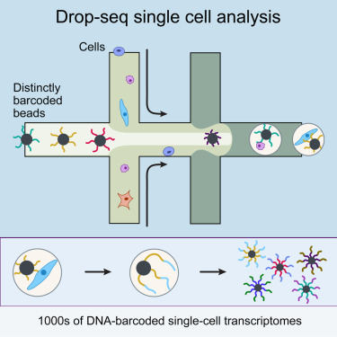

# Preamble: installation of Bioconductor libraries

```{r}
# install BiocManager package if not installed yet.
# BiocManager is the package installer for Bioconductor software.
if (!requireNamespace("BiocManager", quietly = TRUE))
    install.packages("BiocManager")

# install packages if not yet installed.
pkgs <- c("SingleCellExperiment",
          "ExperimentHub",
          "edgeR",
          "biomaRt",
          "DropletUtils", 
          "scRNAseq", 
          "scater", 
          "scuttle", 
          "scran",
          "scry",
          "BiocSingular", 
          "scDblFinder",
          "Seurat",
          "PCAtools",
          "glmpca",
          "genefilter",
          "pheatmap",
          "tidyverse",
          "mclust",
          "ggplot2",
          "SingleR")
notInstalled <- pkgs[!pkgs %in% installed.packages()[,1]]
if(length(notInstalled) > 0){
  BiocManager::install(notInstalled)
}
```

Steps taken in first two lab sessions:

1. Import the Macosko dataset as `SingleCellExperiment` object from the 
`scRNAseq` Bioconductor package.

2. Include ENSEMBL gene identifiers in the `rowData`

3. Remove very lowly expressed genes

4. Remove low quality cells 
  4.1. Cells with outlying library size 
  4.2. Cells with outlying transcriptome complexity 
  4.3. Cells with outlying percentage of mitochondrial reads 
  4.4. Empty droplets 
  4.5. Doublets

5. Normalization 
  5.1. Compute log-normalized counts 
  5.2. Compute scaling factor to correct for differences in library size

6. Feature selection 
  6.1. Genes with high variance 
  6.2. Genes with high variance with respect to their mean expression 
  6.3. Genes with high deviance 
  6.4. Genes with high variance after variance-stabilizing transformation (VST)

7. Dimensionality reduction 
  7.1. Based on two most variable genes from step 6.2. 
  7.2. PCA 
  7.3. GLM-PCA 
  7.4. T-SNE 
  7.5. UMAP

# The Macosko dataset

In this workshop session, we will analyze the single-cell RNA-seq dataset
from the publication by Macosko *et al.*, Cell 161, 1202–1214 from 2015
[(link)](https://doi.org/10.1016/j.cell.2015.05.002). This is the manuscript in
which the droplet scRNA-seq technology **Drop-seq** was introduced.
Six years after the original publication, drop-seq is still one of the most 
commonly adopted scRNA-seq protocols, as evidenced by the
large number of citations for Macosko *et al.* 
(4.303 citations at November 3, 2021).

The basic idea behind the Drop-seq protocol can be taken from the graphical
abstract of the publication.

```

```

The success of Drop-seq can be explained by the following advantageous 
features:

- The use of unique molecular identifiers (UMIs). By working with UMIs, one count
corresponds to one observed mRNA molecule present in the cell. Thanks to the use
of UMI barcodes, PCR artifacts are reduced.

- Scalability: microfluidics technology allows for performing the library prep
reactions inside nanodroplets, in which single cells may be contained. Library prep occurs across all droplets simultaneously.

- Cost: the experiment costs around 6.5 cents (USD) per cell.

- Speed: The very large dataset that we will be working with today was 
generated in an experiment that took only 4 days.

In this particular experiment, Macosko *et al.* sequenced 49,300 cells from the
mouse retina, identifying 39 transcriptionally distinct cell populations. The
experiment was performed in 7 batches.

# Data availability

## SRA

The [Sequence Read Archive (SRA)](https://www.ncbi.nlm.nih.gov/sra) is the 
largest publicly available repository of high-throughput sequencing data.
The data are stored by the National Center for Biotechnology Information (NCBI) 
services and multiple cloud storage providers. From this website "raw" 
sequencing data can be retrieved. In practice, these are usually `.sra` files,
which can be downloaded and converted into FASTQ files using functions
from the `sratoolkit` software. 

For our dataset, the FASTQ data can be retrieved from this 
[link](https://www.ncbi.nlm.nih.gov/Traces/study/?acc=PRJNA267857&o=acc_s%3Aa).
The data are stored as one file per sequencing batch, with each file 
approximately 20Gb. As such, it will be unfeasible to download and process these
FASTQ files in this practical session.

Instead, for demonstrative purposes, we have taken a subsample of the FASTQ
file for the first sequencing batch for you to work with. On this subsample, 
we may perform all the tasks that we would have performed on the full dataset.
The steps that are required for downloading and quantifying drop-seq data
can be found in [a Shell script on our companion GitHub repository](https://github.com/statOmics/singleCellCourse/blob/master/lab1_preprocessing/preprocessDropseq.sh).

## GEO

The dataset from Macosko *et al.* was also uploaded by the authors on the 
Gene Expression Omnibus (GEO) platform under accession number 
[GSE63472](https://www.ncbi.nlm.nih.gov/geo/query/acc.cgi?acc=GSE63472), 
from which raw and readily-processed data files may be retrieved, including:

1. *GSE63472_RAW.tar*, a 90.6Gb object that contains the "raw data" for the
experiment. In the scRNA-seq context, FASTQ files are often considered the raw
data format.

2. *GSE63472_P14Retina_merged_digital_expression.txt.gz*, a 50.7Mb matrix that
stores the gene expression values for each cell. These values are integer 
counts, that did not undergo any type of preprocessing or normalization.

3. *GSE63472_mm10_reference_metadata.tar.gz*, a 862.9Mb compressed folder
containing information on the reference genome to which the scRNA-seq reads
were aligned (see theory slides).

4. *GSE63472_P14Retina_logDGE.txt.gz*, a 316.8Mb compressed text file, not clear
what it contains (results from a differential gene expression analysis, but
with log-transformation, so log-fold changes maybe?).

As such, by downloading *GSE63472_P14Retina_merged_digital_expression.txt.gz*,
we avoid re-quantifying the data, i.e., the translation from reads from the
FASTQ files into a gene-level expression values for each cell. 

One issue that often arises from data downloaded from GEO, is that there is no
strict requirements for which data should be included in the upload by the 
authors. As such, from my personal experience, it can often be the case that
important information like metadata are missing, or the content of the submitted
files is unclear. Even if all the required data are available, as is the case 
here, we would still need to piece all the information together from different 
files and file formats before we can use them.

## ExperimentHub

The Bioconductor *ExperimentHub* web resource, which can be accessed using the 
[ExperimentHub](https://bioconductor.org/packages/release/bioc/html/ExperimentHub.html) 
R package, provides a central location where curated data from experiments, 
publications or training courses can be accessed. While it contains far less
datasets than the SRA or GEO (4965 records to date), these datasets all follow 
the tidy data format of Bioconductor. Note that the ExperimentHub contains 
several types of data, like bulk and single-cell transcriptomics data, 
microarrays and more.

The Macosko dataset is available from ExperimentHub and can be accessed as
follows:

```{r, message=FALSE, warning=FALSE}
library(ExperimentHub)
edb <- ExperimentHub()

edb[grep("Macosko", edb$title)] # find accession number (can be inefficient)

edb_counts <- edb[["EH2690"]]
edb_counts[1:5,1:5]

edb_coldata <- edb[["EH2691"]]
edb_coldata[1:5,]

rm(edb, edb_counts, edb_coldata)
```

## scRNASeq

In addition to ExperimentHub, Bioconductor provides the package
[scRNAseq](https://bioconductor.org/packages/release/data/experiment/html/scRNAseq.html).
This package provides an even more user-friendly client to access (only) 
scRNA-seq datasets from the ExperimentHub web resource. Data retrieved using the
scRNAseq package are stored as user-friendly `SingleCellExperiment` objects, 
with the expression data, gene-level information, cell-level information and 
experiment metadata all in place in one data object. The scRNA-seq package
currently holds 61 datasets, including the data from *Macosko et al.*:

```{r, message=FALSE, warning=FALSE}
library(scRNAseq)
scRNAseq::MacoskoRetinaData()
```

# Import data

The `scRNAseq` package provides convenient access to several datasets. See the [package Bioconductor page](http://bioconductor.org/packages/release/data/experiment/html/scRNAseq.html) 
for more information.

```{r}
# Code below might ask you to create an ExperimentHub directory. 
# Type 'yes' and hit Enter, to allow this.
suppressPackageStartupMessages(library(scRNAseq))
sce <- MacoskoRetinaData()
```

# A `SingleCellExperiment` object

```{r}
sce
```

## Accessing data from a `SingleCellExperiment` object

Please see [Figure 4.1 in OSCA](http://bioconductor.org/books/release/OSCA/data-infrastructure.html) 
for an overview of a `SingleCellExperiment` object.

```{r}
# Data: assays
assays(sce)
assays(sce)$counts[1:5, 1:5]

# Feature metadata: rowData
rowData(sce) # empty for now

# Cell metadata: colData
colData(sce)

# Reduced dimensions: reducedDims
reducedDims(sce) # empty for now
```

## Creating a new `SingleCellExperiment` object

```{r}
sceNew <- SingleCellExperiment(assays = list(counts = assays(sce)$counts))
sceNew

rm(sceNew)
```

## Storing (meta)data in a `SingleCellExperiment` object

```{r}
fakeGeneNames <- paste0("gene", 1:nrow(sce))
rowData(sce)$fakeName <- fakeGeneNames
head(rowData(sce))
# Remove again by setting to NULL
rowData(sce)$fakeName <- NULL

assays(sce)$logCounts <- log1p(assays(sce)$counts)
assays(sce)
assays(sce)$logCounts[1:5, 1:5]
assays(sce)$logCounts <- NULL
```

# Obtaining and including rowData

The `rowData` slot of a `SingleCellExperiment` object allows for storing 
information on the features, i.e. the genes, in a dataset. In our object,
the `rowData` slot is empty.

```{r}
rowData(sce)
```

As such, the only information we have on the genes are their names, which can
be retrieved as the `rownames` of the expression matrix.

```{r}
head(rownames(sce))
```

These are the gene names (symbols). Note that it may be useful to include 
additional information in the `rowData` slot. For instance, we may want to 
store:

- Unambiguous gene identifiers (e.g. from ENSEMBL)
- On which chromosome the gene is located
- Gene length (genomic start position and end position)
- Others...

```{r, message=FALSE, warning=FALSE}
library("biomaRt")

ensembl75 <- useEnsembl(biomart = 'genes', 
                        dataset = 'mmusculus_gene_ensembl',
                        version = 75)

head(listAttributes(ensembl75)) # potential info to extract

geneInfo <- getBM(attributes = c("ensembl_gene_id", # ENSEMBL unambiguous identifier
                                 "mgi_symbol", # Gene symbol (to link with SCE rownames),
                                 "chromosome_name", # On which chromosome
                                 "start_position", # Start position
                                 "end_position"),# End position
                  mart = ensembl75)

head(geneInfo)
```

```{r}
geneInfo$mgi_symbol_upper <- toupper(geneInfo$mgi_symbol) 
# match between gene info and rownames

sum(rownames(sce) %in% geneInfo$mgi_symbol_upper)
sum(!rownames(sce) %in% geneInfo$mgi_symbol_upper) # lost in conversion :(

rowData(sce) <- geneInfo[match(rownames(sce),geneInfo$mgi_symbol_upper),]
```

```{r}
head(rowData(sce))
```

# Filtering non-informative genes

```{r}
library(edgeR)

# A very simple strategy: remove all genes that are expressed in less than 10
# out of 49300 cells -> note that this a very lenient filtering criterium
keep <- rowSums(assays(sce)$counts > 0) > 10
table(keep)

sce <- sce[keep,]
```

Note that dedicated functions for filtering out lowly expressed genes exist.
One such function is the `filterByExpr` function of the edgeR R package.
In brief, the strategy keeps genes that have at least "min.count" reads in a 
worthwhile number samples. 

More precisely, the filtering keeps genes that have count-per-million (CPM) 
above k in n samples. 

k is determined by the min.count argument to the function, and by the sample 
library sizes.

n is determined by the design matrix. n can be seen as the smallest group sample
size. A `group` of samples/cells can be defined as cells that are more similar
to one another, e.g., from the same sequencing batch, the same patient....
Here we could also use the cluster assignment (cell type) for each cell as the
grouping variable; *note however, that this usually is not available until a*
*later stage in the analysis pipeline* (i.e., after dimension reduction and 
clustering, topics we will cover next session.)

If all the group sizes are larger than the `large.n` argument of the 
filterByExpr function, which defaults to 10, then n will be taken as
`min.prop`* the the number of samples/cells in the smallest group.

Note that all the group sizes will often be larger than the `large.n` in case
of single-cell data.

```{r}
# Slow (more than 1min) -> do not run
# keep2 <- filterByExpr(sce,
#                       group = sce$cluster,
#                       min.count = 1,
#                       min.total.count = 15,
#                       min.prop = 0.2)
# table(keep2)
```


# Quality control

In quality control (QC), we check the quality of our dataset. In particular, 
we investigate undesirable oddities, such as low-quality cells, empty droplets
or doublets.

## Identifying and removing low-quality cells

There are several distinguishing features of low-quality cells that can be used
in order to identify them. [As described in the OSCA book](http://bioconductor.org/books/3.14/OSCA.basic/quality-control.html) 
book):

1. The library size is defined as the total sum of counts across all 
relevant features for each cell. Here, we will consider the relevant features 
to be the endogenous genes. Cells with small library sizes are of low quality 
as the RNA has been lost at some point during library preparation, either due 
to cell lysis or inefficient cDNA capture and amplification.

2. The number of expressed features in each cell is defined as the number of 
endogenous genes with non-zero counts for that cell. Any cell with very 
few expressed genes is likely to be of poor quality as the diverse transcript 
population has not been successfully captured.

3. We sometimes have spike-in (ERCC) transcripts available.
The proportion of reads mapped to spike-in transcripts is calculated relative 
to the total count across all features (including spike-ins) for each cell. 
As the same amount of spike-in RNA should have been added to each cell, 
any enrichment in spike-in counts is symptomatic of loss of endogenous RNA.

4. In the absence of spike-in transcripts, the proportion of reads mapped 
to genes in the mitochondrial genome can be used. High proportions are 
indicative of poor-quality cells (Islam et al. 2014; Ilicic et al. 2016), 
presumably because of loss of cytoplasmic RNA from perforated cells. 
The reasoning is that, in the presence of modest damage, the holes in the 
cell membrane permit efflux of individual transcript molecules but are too 
small to allow mitochondria to escape, leading to a relative enrichment of 
mitochondrial transcripts. For single-nuclei RNA-seq experiments, high 
proportions are also useful as they can mark cells where the cytoplasm has 
not been successfully stripped.

## Calculate QC variables

This function calculates useful QC metrics for identification and removal of 
potentially problematic cells. Default per-cell metrics are the sum of counts 
(i.e., the library size) and the number of detected features. The percentage of 
counts in the top features also provides a measure of library complexity.

If subsets is specified, these statistics are also computed for each subset of 
features. This is useful for investigating gene sets of interest, e.g., 
mitochondrial genes.

```{r, message=FALSE, warning=FALSE}
library(scater)

# check ERCC spike-in transcripts
sum(grepl("^ERCC-", rownames(sce))) # no spike-in transcripts available

# check mitochondrial genes
sum(rowData(sce)$chromosome_name=="MT",na.rm = TRUE) # 28 mitochondrial genes
sum(grepl("^MT-", rownames(sce))) # alternatively
is.mito <- grepl("^MT-", rownames(sce))

## calculate QC metrics
df <- perCellQCMetrics(sce, subsets=list(Mito=is.mito))
head(df)

# add QC variables to sce object
colData(sce) <- cbind(colData(sce), df)

# the QC variables have now been added to the colData of our SCE object.
head(colData(sce))
```

## Exploratory data analysis

In the figure below, we see that several cells have a very low number of 
expressed genes, and where most of the molecules are derived from 
mitochondrial genes. This indicates likely damaged cells, presumably because 
of loss of cytoplasmic RNA from perforated cells, so we should remove these for 
the downstream analysis.

```{r,eval=FALSE}
# Number of genes vs library size
plotColData(sce, x = "sum", y="detected", colour_by="cluster") 

# Mitochondrial genes
plotColData(sce, x = "detected", y="subsets_Mito_percent")
```

## QC using adaptive thresholds

Below, we remove cells that are outlying with respect to

 1. A low sequencing depth (number of UMIs);
 2. A low number of genes detected;
 3. A high percentage of reads from mitochondrial genes.
 
 Here we will remove cells for QC based on **adaptive thresholds** related to
 the three points from above. Adaptive trhesholds are used as opposed to
 **fixed thresholds**. 
 
With fixed thresholds, we use fixed cut-off values for each cell to pass QC, 
e.g., we might consider cells to be low quality if they have library sizes 
below 100,000 reads; express fewer than 5,000 genes; have spike-in proportions
above 10%; or have mitochondrial proportions above 10%.

With adaptive thresholds, we assume that most of the dataset consists of 
high-quality cells. We then identify cells that are outliers for the various 
QC metrics, based on the median absolute deviation (MAD) from the median value
of each metric across all cells. By default, we consider a value to be anoutlier 
if it is more than 3 MADs from the median in the “problematic” direction. This 
is loosely motivated by the fact that such a filter will retain 99% of 
non-outlier values that follow a normal distribution. We demonstrate adopting
adaptive thresholds on the Macosko dataset:

```{r}
lowLib <- isOutlier(df$sum, type="lower", log=TRUE)
lowFeatures <- isOutlier(df$detected, type="lower", log=TRUE)
highMito <- isOutlier(df$subsets_Mito_percent, type="higher")

table(lowLib)
table(lowFeatures)
table(highMito)

discardCells <- (lowLib | lowFeatures | highMito)
table(discardCells)
colData(sce)$discardCells <- discardCells

# visualize cells to be removed
# plotColData(sce, x = "sum", y="detected", colour_by="discardCells")
# plotColData(sce, x = "detected", y="subsets_Mito_percent", colour_by = "discardCells")
```

We removed a total of $3423$ cells, most of which because of an outlyingly high 
percentage of reads from mitochondrial genes.

## Identifying and removing empty droplets

Note that the removal of cells with low sequencing depth using the adaptive 
threshold procedure above is a way of removing empty droplets. 
Other approaches are possible, e.g., removing cells by statistical testing 
using `emtpyDrops`. This does require us to specify a lower bound on the total 
number of UMIs, below which all cells are considered to correspond to empty 
droplets. This lower bound may not be trivial to derive, but the `barcodeRanks`
function can be useful to identify an elbow/knee point.

In brief, the steps taken by the `emtpyDrops` function can be summarized as 
follows:

1.	Define threshold T of total UMI counts (e.g. with the help of the 
`barcodeRanks` function), below which cells may be considered to be from empty 
droplets. Call this set of cells E.

2.	Define $A_g$ as the total gene expression across all cells in E.

3.	Define $pi_g$ as the relative contribution of gene g to the ambient profile.

4.	Calculate p-value for each cell to have a transcriptional profile similar to
the ambient solution. Intuitively, a p-value below the requested alpha level 
would correspond to a cell for which the observed count profile strongly 
deviates from the count profile observed in the cells with a library size 
below threshold T, i.e., a non-empty droplet.

```{r, message=FALSE, warning=FALSE}
library(DropletUtils)
bcrank <- barcodeRanks(counts(sce))

# Only showing unique points for plotting speed. Duplicated ranks are a 
# consequence of ties in the ranks, i.e., when cells have an equal library size.
sum(duplicated(bcrank$rank))
uniq <- !duplicated(bcrank$rank)

plot(bcrank$rank[uniq], bcrank$total[uniq], log="xy",
    xlab="Rank", ylab="Total UMI count", cex.lab=1.2)
abline(h=metadata(bcrank)$inflection, col="darkgreen", lty=2)
abline(h=metadata(bcrank)$knee, col="dodgerblue", lty=2)
abline(h=350, col="orange", lty=2) # picked visually myself
legend("topright", 
       legend=c("Inflection", "Knee", "Empirical knee point"), 
       col=c("darkgreen", "dodgerblue", "orange"), 
       lty=2, 
       cex=1.2)

set.seed(100)
limit <- 350   
all.out <- emptyDrops(counts(sce), lower=limit, test.ambient=TRUE)
# p-values for cells with total UMI count under the lower bound.
hist(all.out$PValue[all.out$Total <= limit & all.out$Total > 0],
    xlab="P-value", main="", col="grey80", breaks=20)

# but note that it would remove a very high number of cells
length(which(all.out$FDR <= 0.01)) # retained

# so we stick to the more lenient adaptive filtering strategy
# remove cells identified using adaptive thresholds
sce <- sce[, !colData(sce)$discardCells]
```

## Identifying and removing doublets

We will use 
[scDblFinder](https://bioconductor.org/packages/3.14/bioc/html/scDblFinder.html) 
to detect doublet cells.

As discussed in the theory session of last week, the steps taken by 
`scDblFinder` can be summarized as follows:

1. Perform principal components analysis (PCA) on log-normalized expression 
counts. This allows for projecting each cell in the dataset into a 2D space
(for more details on PCA, see next weeks session).

2. Randomly select two cells, sum their counts and normalize, and project 
into PCA space from step 1. In other words, artificially generate doublets and
see where they are located in the 2D space.

3. Repeat step 2 many times (generate many artificial doublets).

4. Generate neighbor network in the 2D space. The network is then used to 
estimate a number of characteristics for each cell, in particular the proportion 
f artificial doublets among the nearest neighbors.

5. Use this information, along with other predictors, to train a classifier
(gradient boosted tree) that allows for distinguishing doublets from singlets.

Note: only classifies for identifying doublets for which the two cells
are from different cell type clusters.


```{r, message=FALSE, warning=FALSE}
## perform doublet detection
library(scDblFinder)
```

```{r}
set.seed(211103)
sampleID <- unlist(lapply(strsplit(colData(sce)$cell.id, split="_"), "[[", 1))
table(sampleID)
sce <- scDblFinder(sce, 
                   returnType="table",
                   samples = factor(sampleID))
table(sce$scDblFinder.class)


## visualize these scores
## explore doublet score wrt original cluster labels
boxplot(log1p(sce$scDblFinder.score) ~ factor(colData(sce)$cluster, exclude=NULL))

tab <- table(sce$scDblFinder.class, sce$cluster, 
      exclude=NULL)
tab
t(t(tab) / colSums(tab))

barplot(t(t(tab) / colSums(tab))[2,],
        xlab = "Cluster", ylab = "Fraction of doublets")

range(sce$scDblFinder.score[sce$scDblFinder.class  == "doublet" & sampleID == "r1"])
range(sce$scDblFinder.score[sce$scDblFinder.class  == "singlet" & sampleID == "r1"])
```

```{r}
# remove doublets
sce <- sce[,!sce$scDblFinder.class == "doublet"]
```

# Normalization

Normalization aims to remove technical effects such as sequencing depth so that 
comparisons between cells are not confounded by them. The most commonly used 
normalization methods methods use scaling, where a scaling factor (also called 
size factor, normalization factor) is estimated for each cell. These scaling 
factors (e.g., the effective library size) can be included as an offset
to downstream modeling procedures. This effectively allows for performing
inference on the relative abundance of a gene in a cell, after accounting for 
library size and RNA composition differences between cells, which is much more
relevant than comparing raw counts

For normalization, the size factors $s_i$ computed here are simply scaled 
library sizes:
\[ N_i = \sum_g Y_{gi} \]
\[ s_i = N_i / \bar{N}_i \]

```{r}
sce <- logNormCounts(sce)

# note we also returned log counts: see the additional logcounts assay.
sce

# you can extract size factors using
sf <- librarySizeFactors(sce)
mean(sf) # equal to 1 due to scaling.
plot(x= log(colSums(assays(sce)$counts)), 
     y=sf)
```

From the OSCA book:
Alternatively, we may use more sophisticated approaches for variance stabilizing 
transformations in genomics data, e.g., `DESeq2` or `sctransform`. These aim 
to remove the mean-variance trend more effectively than the simpler 
transformations mentioned above, though it could be argued whether this is 
actually desirable. For low-coverage scRNA-seq data, there will always be a 
mean-variance trend under any transformation, for the simple reason that the 
variance must be zero when the mean count is zero. These methods also face the 
challenge of removing the mean-variance trend while preserving the interesting 
component of variation, i.e., the log-fold changes between subpopulations; this 
may or may not be done adequately, depending on the aggressiveness of 
the algorithm.

In practice, the log-transformation is a good default choice due to its 
simplicity and interpretability, and is what we will be using for all 
downstream analyses.

---

--- end lab session 1 ---

---

# Normalization (continued)

Normalization is necessary to correct for several sources of technical 
variation:

 - **Differences in sequencing depth** between samples. Some samples get 
 sequenced deeper in the sense that they consist of more (mapped) reads and 
 therefore can be considered to contain a higher amount of information, which 
 we should be taking into account. In addition, if a sample is sequenced deeper, 
 it is natural that the counts for each gene will be higher, jeopardizing a 
 direct comparison of the expression counts.
 - **Differences in RNA population composition** between samples. As an extreme 
 example, suppose that two samples have been sequenced to the exact same depth.
 One sample is contaminated and has a very high concentration of the 
 contaminant cDNA being sequenced, but otherwise the two samples are identical. 
 Since the contaminant will be taking up a significant proportion of the reads 
 being sequenced, the counts will not be directly comparable between the 
 samples. Hence, we may also want to correct for differences in the composition 
 of the RNA population of the samples 
 (see [edgeR manual chapter 2.8](https://www.bioconductor.org/packages/release/bioc/vignettes/edgeR/inst/doc/edgeRUsersGuide.pdf)).
 - **Other technical variation** such as sample-specific GC-content or 
 transcript length effects may also be accounted for.
 
```{r}
table(sce$cluster)
```

Below, we will visualize the normalization occurring between two cells of the 
same cell type (which could be considered technical repeats): 

```{r}
select <- sce$cluster == "1"
select[is.na(select)] <- FALSE
cs <- colSums(assays(sce)$counts[,select])
cs[order(cs, decreasing = TRUE)][c(1,10)]
```

Let’s take a look at how comparable two cells (replicates) of cluster 1 are. 
We will compare the cell with the highest library size with the cell that has 
the 10th highest library size using MD-plots (mean-difference plots, as 
introduced by 
[Dudoit et al. (2002)](https://www.jstor.org/stable/24307038?seq=1#metadata_info_tab_contents)), 
also sometimes referred to as MA-plots.

```{r}
targetCells <- names(cs[order(cs, decreasing = TRUE)][c(1,10)])

M <- rowMeans(assays(sce)$counts[,targetCells])
D <- assays(sce)$counts[,targetCells[2]] / assays(sce)$counts[,targetCells[1]]
plot(x = log(M), y = log2(D),
     pch = 16, cex=1/3,
     main = paste0("Cell ", targetCells[2], " vs cell ", targetCells[1]),
     xlab = "Log mean", ylab = "Log2 fold-change",
     bty = 'l')
abline(h = 0, col="orange", lwd=2)

```

We see clear bias in the comparison of the 1st and 10th most deeply sequenced 
cell from cell cluster 1. We see that the log fold-changes are biased downwards. 
This means that, on average, a gene is higher expressed in cell 1 versus cell 10.
Looking at the library sizes, we can indeed see that the library size for 
cell 1 is 20869 counts, while it is only 14719 counts for cell 10! This is a
clear library size effect that we should take into account.

```{r}
# normalize the count data using the previously computed "size factors"
assay(sce, "normed") <- normalizeCounts(sce, 
                                        log=FALSE,
                                        size.factors=sce$sizeFactor, 
                                        pseudo.count=0)

M <- rowMeans(assays(sce)$normed[,targetCells])
D <- assays(sce)$normed[,targetCells[2]] / assays(sce)$normed[,targetCells[1]]
plot(x = log(M), y = log2(D),
     pch = 16, cex=1/3,
     main = paste0("Cell ", targetCells[2], " vs cell ", targetCells[1]),
     xlab = "Log mean", ylab = "Log2 fold-change",
     bty = 'l')
abline(h = 0, col="orange", lwd=2)
```

Upon normalizing the data using size factors, we have removed bias as a
consequence of differences in sequencing depth.

Note that we computed the normalized count matrix only for demonstrating the
effect of such normalization. In a typical workflow, the size factors are used
as offsets in the downstream models rather than to perform data transformation.
In brief, such transformation would distort the mean-variance relationship
in the data. For more details, we refer to the document that was touched upon
in the first theory session
([link](https://statomics.github.io/SGA21/sequencing_scalingNormalization.html))

# Feature selection

As dimensions increase, shortest and farthest distances between points become
nearly inseparable. In high-dimensional space, it is therefore extremely 
difficult to separate signal from noise.

In order to recover structure (e.g. setting up a dimension-reduced
space to help us find cell-type clusters in the data), we want to move to an
informative, lower-dimensional space. We will select genes which we hope are
informative for recovering the biological structure. But what defines an 
informative gene?

## Selecting genes with high variance

The simplest approach to quantifying per-gene variation is to compute the 
variance of the log-normalized expression values (i.e., "log-counts") for 
each gene across all cells. 

```{r, eval=FALSE}
# calculate variance of log-normalized counts for each gene
geneVars <- genefilter::rowVars(assays(sce)$logcounts)
# select top 1000 highly variable genes
highVarGenes <- names(geneVars)[order(geneVars, decreasing=TRUE)[1:1e3]]
head(highVarGenes)
```

## Selecting genes with high variation with respect to mean

While calculation of the per-gene variance is simple, feature selection requires
modelling of the mean-variance relationship. Indeed, not accounting for the 
mean-variance structure while selecting highly variable genes will oftentimes 
boil down to selecting the most highly expressed genes. The log-transformation 
is a helpful variance stabilizing transformation, however, it is not perfect, 
meaning that the variance of a gene is not completely independent of its mean.
Therefore, feature selection may still be driven by average expression rather 
than underlying biological heterogeneity.

A (rightly so) popular approach is to select genes that have a high variance
with respect to their mean. Often, first an empirical mean-variance trend is
fitted, upon which genes with the highest positive residuals are selected. 
Being intuitive, reasonable and fairly straight-forward, this method is widely
used.

To account for the mean-variance effect, we use the `modelGeneVar` function of
the `scran` package to fit a trend to the variance with respect to abundance
across all genes (on log-normalized expression values of the sce object).

```{r}
library(scran)
dec <- modelGeneVar(sce)
head(dec)
```

The fitted value for each gene is used as a proxy for the technical component of
variation for each gene, under the assumption that most genes exhibit a low
baseline level of variation that is not biologically interesting. The biological
component of variation for each gene is defined as the the residual from the
trend. Ranking genes by the biological component enables identification of
interesting genes for downstream analyses in a manner that accounts for the
mean-variance relationship.

```{r}
fitRetina <- metadata(dec)
plot(fitRetina$mean, fitRetina$var, 
     xlab="Mean of log-expression",
    ylab="Variance of log-expression")
curve(fitRetina$trend(x), col="dodgerblue", add=TRUE, lwd=2)
```

We are interested in those genes for which the variance in expression is higher
than what we would expect for that gene based on its mean expression.

```{r}
# get 10% most variable genes
hvg <- getTopHVGs(dec, 
                  prop=0.1)
head(hvg)

# plot these 
plot(fitRetina$mean, fitRetina$var, 
     col = c("orange", "darkseagreen3")[(names(fitRetina$mean) %in% hvg)+1],
     xlab="Mean of log-expression",
    ylab="Variance of log-expression")
curve(fitRetina$trend(x), col="dodgerblue", add=TRUE, lwd=2)
legend("topleft", 
       legend = c("Selected", "Not selected"), 
       col = c("darkseagreen3", "orange"),
       pch = 16,
       bty='n')
```

As a comparison, we could color the genes on this figure according to the 
selection that was made purely by looking at the raw variance of each gene.

```{r, eval=FALSE}
plot(fitRetina$mean, fitRetina$var, 
     col = c("orange", "steelblue")[(names(fitRetina$mean) %in% highVarGenes)+1],
     xlab="Mean of log-expression",
    ylab="Variance of log-expression")
curve(fitRetina$trend(x), col="dodgerblue", add=TRUE, lwd=2)
legend("topleft", 
       legend = c("Selected", "Not selected"), 
       col = c("steelblue", "orange"),
       pch = 16,
       bty='n')
```

As expected, we here simply select genes with a high variance, without 
recognizing that a high variance is typically driven by a high mean.

## High deviance genes

Here, we will select genes with a high residual deviance. The idea is that we 
assume a null model of constant expression fraction (i.e., RNA concentration) 
across all cells. We subsequently calculate a goodness-of-fit statistic for 
each gene, assessing whether the model is a good approximation to the gene 
expression of the corresponding gene.

If the model fits poorly, i.e., the gene has a high deviance, the expression 
fraction varies significantly across the cells in our datasets.Genes with a 
high deviance will thus most poorly fit a null model where the relative
abundance is equal for all cells, which therefore are informative.

```{r}
#BiocManager::install("scry")
library(scry)
sce <- devianceFeatureSelection(object = sce, 
                                assay = "counts", 
                                sorted = FALSE)

plot(sort(rowData(sce)$binomial_deviance, decreasing = TRUE), 
     type="l", 
     xlab="ranked genes", 
     ylab="binomial deviance", 
     main="Feature Selection with Deviance")
abline(v=2000, lty=2, col="red")
```

Our plot looks similar to one displayed in the 
[vignette of the scry package](https://www.bioconductor.org/packages/release/bioc/vignettes/scry/inst/doc/scry.html). 
Based on that plot, the authors suggest retaining 2.000 genes (the top 2000 
based on the deviance residuals) for downstream dimensionality reduction and 
clustering.

## Seurat VST

Another very common feature selection strategy is the variance-stabilizing
transformation from the `Seurat` R package, which amounts to calculating Pearson
residuals from a regularized negative binomial regression model, with sequencing 
depth as a covariate.

**Intermezzo: interoperability between SingleCellExperiment and Seurat objects**

In this lecture series, we always make use of the SingleCellExperiment object
and the packages available from Bioconductor. Another very popular toolbox
for performing scRNA-seq data analysis is `Seurat`. However, functions from
`Seurat` cannot be used directly to manipulate `SingleCellExperiment` objects,
and vice versa. Fortunately, efforts have been made to increase the
interoperability between the two toolboxes.

```{r}
library(Seurat)
seurat_obj <- as.Seurat(sce)
seurat_obj # notice the "0 variable features"
```

On this object, we may use functions from the `Seurat` toolbox.
For instance, we may search for highly variable features using `Seurat`'s VST
implementation:

```{r}
seurat_obj <- Seurat::NormalizeData(seurat_obj, 
                                    normalization.method = "LogNormalize", 
                                    scale.factor = 10000)

seurat_obj <-  FindVariableFeatures(object = seurat_obj,
                                    selection.method = "vst")
```

```{r}
seurat_obj  # notice the "2000 variable features" (default)
head(VariableFeatures(seurat_obj)) # here they are
```

# Dimensionality reduction

Note that, below, we color the cells using the known, true cell type label as 
defined in the metadata, to empirically evaluate the dimensionality reduction. 
In reality, we don't know this yet at this stage.

## The most basic DR

Just by looking at the top two genes based on our feature selection criterion, 
we can already see some separation according to the cell type!

```{r}
colData(sce)$cluster <- as.factor(colData(sce)$cluster)
cl <- colData(sce)$cluster
par(bty='l')
plot(x = assays(sce)$counts[hvg[1],],
     y = assays(sce)$counts[hvg[2],],
     col = as.numeric(cl),
     pch = 16, cex = 1/3,
     xlab = "Most informative gene",
     ylab = "Second most informative gene",
     main = "Cells colored acc to cell type")
```

We are able to recover quite some structure. However, many cell populations 
remain obscure, and the plot is overcrowded.

## Linear dimensionality reduction: PCA

A DR method is linear when the reduced dimensions are a linear function of the
original variables. For example, in PCA, each principal component is a linear
combination of genes, therefore the DR is a linear function of the original
variables.

Typically, PCA is performed on log-transformed normalized counts. 
The log-transformation helps  somewhat, but not completely, to account for the
mean-variance relationship. PCA works well for bulk RNA-seq data. However, the
structure of scRNA-seq data is often too complex to be visualized by a small 
number of PCs.

There are several R functions that allow you to perform PCA. Here, we make use
of the `runPCA` function of the `scater` package, which has been specifically
developed for performing PCA on `SingleCellExperiment` objects.
We calculate the top 30 principal components.

### PCA with feature selection

```{r}
set.seed(1234)
sce <- runPCA(sce, 
              ncomponents=30, 
              subset_row=hvg)
```

PCA has been performed. The PCA information has been automatically stored in the
*reducedDim* slot of the SingleCellExperiment object.

```{r}
reducedDimNames(sce)
```

```{r, eval=FALSE}
head(reducedDim(sce,
           type="PCA"))
```

The `plotPCA` function of the `scater` package now allows us to visualize
the cells in PCA space, based on the PCA information stored in our object:

```{r, eval=FALSE}
plotPCA(sce, 
        colour_by = "cluster")
```

While the large number of clusters in this dataset makes it hard to 
distinguish between all the different colors, we can already see that PCA
retrieves some, but not all, of the structure in the data that was discovered
by the original authors.

How many of the top PCs should we retain for downstream analyses? The choice of
the number of PCs is a decision that is analogous to the choice of the number of
HVGs to use. Using more PCs will retain more biological signal at the cost of
including more noise that might mask said signal. On the other hand, using fewer
PCs will introduce competition between different factors of variation, where
weaker (but still interesting) factors may be pushed down into lower PCs and
inadvertently discarded from downstream analyses.

Most analysts will simply aim to use a “reasonable” but arbitrary value,
typically ranging from 10 to 50. This is often satisfactory as the later PCs
explain so little variance that their inclusion or omission has no major effect.

```{r}
percent.var <- attr(reducedDim(sce), "percentVar")
plot(percent.var, log="y", xlab="PC", ylab="Variance explained (%)")
plot(cumsum(percent.var), xlab="PC", ylab="Cumulative variance explained (%)")
```

Here, retaining ±15PCs seems reasonable. If you really prefer a more data-driven
way for determining this, there are procedures available that aim to 
computationally identify the elbow/knee point in the variance explained per 
PC plot.

```{r}
library(PCAtools)
chosen.elbow <- findElbowPoint(percent.var)
chosen.elbow
```

### PCA without feature selection

Note: more features -> computationally more intensive!

```{r}
set.seed(1234)
sceNoFS <- runPCA(sce, 
                  ncomponents=30, 
                  subset_row=1:nrow(sce))
plotPCA(sceNoFS, colour_by = "cluster")
rm(sceNoFS)
```

While we use more information to make this PCA plot (17.887 genes) as compared
to the feature selected PCA plot (642 genes), we seem to retrieve less structure
in the data. This is the power of feature selection, an increase in the
signal-to-noise ratio!

### Effect of feature selection on PCA

First, we compare the different feature selection criteria, using the top 1000
highly variable genes for each method.

```{r, eval=FALSE}
# Get top 1000 highly variable features using the highly variable genes
# (w.r.t. mean), high deviance genes and the VST strategy of Seurat

hvg1000 <- getTopHVGs(dec, n = 1000)
hdg1000 <- names(sort(rowData(sce)$binomial_deviance, decreasing = TRUE))[1:1000]
vst1000 <- VariableFeatures(seurat_obj)[1:1000]

# HVG strategy
plotPCA(
    runPCA(sce,
           ncomponents = 2, 
           subset_row = hvg1000), 
    colour_by = "cluster") +
  ggtitle("Highly variable genes")

# HDG strategy
plotPCA(
    runPCA(sce,
           ncomponents = 2, 
           subset_row = hdg1000), 
    colour_by = "cluster") +
  ggtitle("High-deviance genes")

# VST strategy
plotPCA(
    runPCA(sce,
           ncomponents = 2,
           subset_row = vst1000),
    colour_by = "cluster",
    ) +
  ggtitle("Seurat VST")
```

Next, we assess the sensitivity on the number of top features for the highly
variable genes method;

```{r, eval=FALSE}
hvg_all <- getTopHVGs(dec)

hvg2000 <- hvg_all[1:2000]
hvg1000 <- hvg_all[1:1000]
hvg100 <- hvg_all[1:100]
hvg10 <- hvg_all[1:10]
hvg5 <- hvg_all[1:5]

plotPCA(
    runPCA(sce,
           ncomponents = 2), 
    colour_by = "cluster") +
  ggtitle("All genes")

plotPCA(
    runPCA(sce,
           ncomponents = 2, 
           subset_row = hvg2000), 
    colour_by = "cluster") +
  ggtitle("Top 2000 genes")

plotPCA(
    runPCA(sce,
           ncomponents = 2, 
           subset_row = hvg1000), 
    colour_by = "cluster") +
  ggtitle("Top 1000 genes")

plotPCA(
    runPCA(sce,
           ncomponents = 2, 
           subset_row = hvg100), 
    colour_by = "cluster") +
  ggtitle("Top 100 genes")

plotPCA(
    runPCA(sce,
           ncomponents = 2, 
           subset_row = hvg10), 
    colour_by = "cluster") +
  ggtitle("Top 10 genes")

plotPCA(
    runPCA(sce,
           ncomponents = 2, 
           subset_row = hvg5), 
    colour_by = "cluster") +
  ggtitle("Top 5 genes")
```

### Remarks on PCA

Visualizations of reduced dimensions from linear dimensionality reduction
methods are often "overcrowded", and it is hard to see structure (e.g., the PCA
plot we just saw). Non-linear dimensionality reduction methods can overcome this
problem. As the name suggests, the reduced dimensions are a non-linear function
of the observed data. We will not go into detail as to how these work under the
hood, but provide a few guidelines for the most popular methods. Often, the top
(~10-50) PCs are provided as input.

## A generalization of PCA for exponential family distributions.

PCA is implicitly based on Euclidean distances, corresponding to maximizing a
Gaussian likelihood, which is inappropriate for count data such as scRNA-seq.
[Townes et al.](https://doi.org/10.1186/s13059-019-1861-6) (2019) develop
GLM-PCA, a generalization of PCA for exponential family likelihoods. They posit,
using negative control data, that the data generative mechanism of UMI count
data can be considered to be multinomial.

The GLM-PCA strategy is implemented in the `glmpca` function of the `glmpca`
package.

Note that this function is quite computationally intensive. For regular PCA 
on log-transformed normalized counts, the underlying computations can be 
strongly simplified. Here, we work with the raw counts, which we assume to 
be *Poisson* distributed, requiring an iterative optimization scheme.

```{r}
# runs 2min on my laptop
library(glmpca)
set.seed(211103)
poipca <- glmpca(Y = assays(sce)$counts[hvg,],
                 L = 2, 
                 fam = "poi",
                 minibatch = "stochastic")
reducedDim(sce, "PoiPCA") <- poipca$factors
plotReducedDim(sce, 
               dimred="PoiPCA",
               colour_by = "cluster")
```

Alternatively, we could adopt the GLM-PCA strategy using only the genes with 
high deviance.

```{r}
# Based on the diagnostic plot from the feature selection, we would select the 
# top 2000 genes with highest deviance. However, to reduce the running time of
# the function, I here select the top 500 (which still is quite slow - 5min).
Sys.time()
hdg <- names(sort(rowData(sce)$binomial_deviance, decreasing = TRUE))[1:500]

set.seed(471681)
poipca_dev <- glmpca(Y = assays(sce)$counts[hdg,],
                 L = 2, 
                 fam = "poi",
                 minibatch = "stochastic")
Sys.time()
reducedDim(sce, "PoiPCA_dev") <- poipca_dev$factors
plotReducedDim(sce, 
               dimred="PoiPCA_dev",
               colour_by = "cluster")
```

The authors of the `glmpca` package note that GLM-PCA can be slow for large 
datasets. Therefore, they have implemented a fast approximation of the 
algorithm, which first fits a null model of constant expression for each gene 
across all cells, and subsequently fits standard PCA to either the Pearson or 
deviance residuals from the null model.

However, at least for me the `nullResiduals` function was **extremely slow**
even slower than the `glmpca` code above. Therefore, **I suggest not running**
this code, but I leave it in for reference.

```
sce <- nullResiduals(sce, assay="counts", type="deviance")
sce <- nullResiduals(sce, assay="counts", type="pearson")

pca<-function(Y, L=2, center=TRUE, scale=TRUE){
    #assumes features=rows, observations=cols
    res<-prcomp(as.matrix(t(Y)), center=center, scale.=scale, rank.=L)
    factors<-as.data.frame(res$x)
    colnames(factors)<-paste0("dim", 1:L)
    factors
}
pca_d <- pca(assay(sce[hdg,], "binomial_deviance_residuals"))
pca_d$resid_type <- "deviance_residuals"
pca_p <- pca(assay(sce[hdg,], "binomial_pearson_residuals"))
pca_p$resid_type <- "pearson_residuals"
cm <- as.data.frame(colData(sce[hdg,]))
pd <- rbind(cbind(cm, pca_d), cbind(cm, pca_p))
ggplot(pd, aes(x=dim1, y=dim2, colour=phenoid)) + geom_point() +
  facet_wrap(~resid_type, scales="free", nrow=2) +
  ggtitle("PCA applied to null residuals of high deviance genes")
```

## Non-linear dimensionality reduction: t-SNE

t-SNE focuses on preserving local rather than global distances. Therefore,
distances on a t-SNE reduced dimension plot can only be interpreted locally,
i.e., cells that are close together in reduced dimension will have a similar
transcriptome, but cells that are far away may not necessarily have a very distinct transcriptome.

Running t-SNE on a `SingleCellExperiment` object can be achieved with the
`runTSNE` function of the `scater` package. By default, this function will first
perform PCA, and use the top 50 PCs as an input to the actual t-SNE
algorithm. Since we already performed PCA, we may set `dimred = "PCA"` as
argument to the function. As such we will be performing a T-SNE on the 30 PCs
we computed before. If we would like to run t-SNE only using the top 10
PCs, we could set `n_dimred = 10`.

In addition, we may wish to set `external_neighbors=TRUE`, which increases the
speed of the algorithm for large datasets by applying a heuristic.

**Note:** for me this was the slowest function of the analysis (so far). If you
feel like your PC/laptop had a lot of trouble with the previous step(s), you
may consider not running this code, or running it on a subset of the data
(e.g., randomly subsampling cells) for demonstrational purposes. 
Alternatively, you may consider reducing the input space for the t-SNE 
algorithm, e.g. by setting `n_dimred = 5`.

```{r}
# (For me it takes 3min30 with n_dimred = 5)
sce <- runTSNE(sce, 
               dimred = 'PCA',
               n_dimred = 5,
               external_neighbors=TRUE)
plotTSNE(sce,
         colour_by = "cluster")
```

## Non-linear dimensionality reduction: UMAP

It is often suggested that UMAP is better than t-SNE in preserving global 
differences. Therefore, UMAP is also often used in analyses such as trajectory 
inference, where this is important.

Running UMAP on a `SingleCellExperiment` object can be achieved with the
`runUMAP` function of the `scater` package.

```{r}
# Using top 10% highly variable genes and top 30 PCs
sce <- runUMAP(sce, 
               dimred = 'PCA', 
               external_neighbors = TRUE)
plotUMAP(sce,
         colour_by = "cluster")

# Using top 10% highly variable genes and top 10 PCs
plotUMAP(runUMAP(sce, 
               dimred = 'PCA', 
               external_neighbors = TRUE,
               n_dimred = 10),
  colour_by = "cluster")
```

---

--- end lab session 2 ---

---

# Read results from first two sessions

```{r,eval=FALSE}
sce <- readRDS("./sce_after_labsession2.rds") # change to YOUR path!
```

# Add cluster information from publication

```{r, message=FALSE, warning=FALSE}
library(tidyverse)
sce$cluster_lowRes <- fct_recode(colData(sce)$cluster, 
           "Horizontal_cells" = "1",
           "Ganglion_cells" = "2",
           "Amacrine" = "3",
           "Amacrine" = "4",
           "Amacrine" = "5",
           "Amacrine" = "6",
           "Amacrine" = "7",
           "Amacrine" = "8",
           "Amacrine" = "9",
           "Amacrine" = "10",
           "Amacrine" = "11",
           "Amacrine" = "12",
           "Amacrine" = "13",
           "Amacrine" = "14",
           "Amacrine" = "15",
           "Amacrine" = "16",
           "Amacrine" = "17",
           "Amacrine" = "18",
           "Amacrine" = "19",
           "Amacrine" = "20",
           "Amacrine" = "21",
           "Amacrine" = "22",
           "Amacrine" = "23",
           "Rods" = "24",
           "Cones" = "25",
           "Bipolar" = "26",
           "Bipolar" = "27",
           "Bipolar" = "28",
           "Bipolar" = "29",
           "Bipolar" = "30",
           "Bipolar" = "31",
           "Bipolar" = "32",
           "Bipolar" = "33",
           "Muller_glia" = "34",
           "Astrocytes" = "35",
           "Fibroblast" = "36",
           "Vascular_endothelium" = "37",
           "Pericytes" = "38",
           "Microglia" = "39")

sce$cluster_highRes <- fct_recode(colData(sce)$cluster, 
           "Horizontal_cells" = "1",
           "Ganglion_cells" = "2",
           "Amacrine_1" = "3",
           "Amacrine_2" = "4",
           "Amacrine_3" = "5",
           "Amacrine_4" = "6",
           "Amacrine_5" = "7",
           "Amacrine_6" = "8",
           "Amacrine_7" = "9",
           "Amacrine_8" = "10",
           "Amacrine_9" = "11",
           "Amacrine_10" = "12",
           "Amacrine_11" = "13",
           "Amacrine_12" = "14",
           "Amacrine_13" = "15",
           "Amacrine_14" = "16",
           "Amacrine_15" = "17",
           "Amacrine_16" = "18",
           "Amacrine_17" = "19",
           "Amacrine_18" = "20",
           "Amacrine_19" = "21",
           "Amacrine_20" = "22",
           "Amacrine_21" = "23",
           "Rods" = "24",
           "Cones" = "25",
           "Bipolar_1" = "26",
           "Bipolar_2" = "27",
           "Bipolar_3" = "28",
           "Bipolar_4" = "29",
           "Bipolar_5" = "30",
           "Bipolar_6" = "31",
           "Bipolar_7" = "32",
           "Bipolar_8" = "33",
           "Muller_glia" = "34",
           "Astrocytes" = "35",
           "Fibroblast" = "36",
           "Vascular_endothelium" = "37",
           "Pericytes" = "38",
           "Microglia" = "39")
```

# Clustering

## Graph-based clustering

First, we discuss graph-based clustering methods for scRNA-Seq data.
This is very well explained in the 
[OSCA book chapter 5.2](http://bioconductor.org/books/3.14/OSCA.basic/clustering.html#clustering-graph).

As written in the OSCA book: "Popularized by its use in Seurat, graph-based 
clustering is a flexible and scalable technique for clustering large scRNA-seq 
datasets. We first build a graph where each node is a cell that is connected 
to its nearest neighbors in the high-dimensional space. Edges are weighted 
based on the similarity between the cells involved, with higher weight given 
to cells that are more closely related. We then apply algorithms to identify 
“communities” of cells that are more connected to cells in the same community 
than they are to cells of different communities. Each community represents a 
cluster that we can use for downstream interpretation.

The major advantage of graph-based clustering lies in its scalability. It only 
requires a k-nearest neighbor search that can be done in log-linear time on 
average, in contrast to hierarchical clustering methods with runtimes that are 
quadratic with respect to the number of cells. Graph construction avoids making 
strong assumptions about the shape of the clusters or the distribution of cells 
within each cluster, compared to other methods like k-means (that favor 
spherical clusters) or Gaussian mixture models (that require normality)."

Several graph-based clustering algorithms are implemented in the `scran` library. 
The most global wrapper-function in this package is the `clusterCells` function. 
Typically, the input to this function is a `SingleCellExperiment` object with 
pre-computed principal components; these are used to take advantage of data 
compression and denoising. If the default settings are adopted, `clusterCells`
will perform two steps under the hood:

1. Build a shared nearest neighbors (SNN) graph of observations for downstream community 
detection. The SNN graph is closely related to the more common KNN graph. For 
each observation, its k-nearest neighbors are identified (k=10 by default), 
based on distances between their expression profiles (Euclidean distances are 
used by default) as observed in PCA space. An edge is drawn between all pairs 
of observations that share at least one neighbor, weighted by the characteristics 
of the shared nearest neighbors.

2. The `clusterCells` function next internally calls the `cluster_walktrap` function 
from the `igraph` library. Based on the SNN graph from step 1, this function tries
to find densely connected subgraphs, also called communities in a graph via 
random walks. The idea is that short random walks tend to stay in the same 
community.

```
# Do not run; clusterCells function with default settings, i.e., building an
# SNN graph and finding clusters with the walktrap algorithm.
library(scran)
nn.clusters <- clusterCells(sce, 
                            use.dimred="PCA")
table(nn.clusters)
```

The disadvantage of using `clusterCells` is that the default setting of the 
second step, the `cluster_walktrap` function, is slow for large datasets. While 
it is possible to adjust the different arguments of the `clusterCells` function,
it might be more clear and intuitive to simply break up the process in two steps:
building the graph and detecting clusters in that graph. For this second step, 
we may then adopt a faster algorithm.

### Build graph (SNN graph)

```{r}
# Build a shared nearest-neighbor graph from PCA space
graph <- buildSNNGraph(sce, 
                       use.dimred = 'PCA')
# alternative: buildKNNGraph()
```

### Detect clusters on the graph

Two popular graph-based clustering algorithm are the `leiden` and `louvain` 
algorithms, both referring to the location of its developers. A common 
implementation of the 
[`louvain`algorithm](https://iopscience.iop.org/article/10.1088/1742-5468/2008/10/P10008) 
is to optimize the modularity, effectively attempting to maximize the difference 
between the observed number of edges in a community and the expected number of 
such edges.

However, additional evaluations found that modularity optimization using the 
`louvain` algorithm is confined to a 
[resolution limit](https://www.pnas.org/content/104/1/36), and in addition may 
result in communities that are not well connected. 
The [`leiden` algorithm](https://www.nature.com/articles/s41598-019-41695-z), 
instead, guarantees well-connected communities.

```{r}
set.seed(464688)
# Walktrap community finding algorithm on the SNN graph
# DO NOT RUN -> takes 20 minutes
# cluster_walktrap <- factor(igraph::cluster_walktrap(g)$membership) #20min

# The `cluster_fast_greedy` function tries to find dense subgraph, also called 
# communities in graphs via directly optimizing a modularity score
# DO NOT RUN -> takes 4 minutes
# cluster_fastGreedy <- factor(igraph::cluster_fast_greedy(graph)$membership) #4min

# Louvain clustering on the SNN graph
cluster_louvain <- factor(igraph::cluster_louvain(graph)$membership) #8sec
nlevels(cluster_louvain) # 11 clusters

# Leiden clustering on the SNN graph
cluster_leiden <- factor(igraph::cluster_leiden(graph)$membership) #10sec
nlevels(cluster_leiden) # 1326 different clusters!

cluster_leiden2 <- factor(igraph::cluster_leiden(graph = graph,
                                                 resolution_parameter = 0.01)$membership) #10sec
nlevels(cluster_leiden2) #14 different clusters

# Add to sce and visualize
colData(sce)$cluster_louvain <- cluster_louvain
colData(sce)$cluster_leiden2 <- cluster_leiden2
```

### Comparing clustering strategies

A direct comparison of the Louvain and Leiden clustering results using a table 
of the cluster labels, shows good agreement.

```{r}
table(cluster_louvain, cluster_leiden2)
```
             
First, note that Leiden2 clusters 9-14 all contain only 1 cell, which doesn’t 
make much sense.

Next, we see the following clear correspondences between the cluster labels:

Louvain 1 -> Leiden 1
Louvain 6 -> Leiden 2
Louvain 3 -> Leiden 4
Louvain 7 -> Leiden 6
Louvain 8 -> Leiden 7
Louvain 10 -> Leiden 8

For the remaining clusters, we see that 
- Leiden cluster 3 contains almost cells of Louvain clusters 2, 9 and 11 
- Leiden cluster 5 contains almost cells of Louvain clusters 4 and 5

To make a visualization that gives us very similar information, we may use a 
heatmap:

```{r}
library(pheatmap)
pheatmap::pheatmap(table(cluster_louvain, cluster_leiden2))
```

Alternatively, we may compute a clustering similarity score that captures the 
agreement between two sets of partitions. The Adjusted Rand Index (ARI) is often
used in the literature for this purpose. The ARI is equal to 1 if the two 
partitions agree perfectly, and it is zero if the two partitions are unrelated. 
In some cases, the ARI may also be negative if the partitions are much more 
different than what could be expected by chance.

```{r}
library(mclust)
mclust::adjustedRandIndex(cluster_louvain[-which(cluster_leiden2 %in% c(9:14))], 
                          cluster_leiden2[-which(cluster_leiden2 %in% c(9:14))])
```

### Visualization

```{r}
# Visualization. Add the cluster labels to the previously generated TSNE
# coordinates
plotTSNE(sce, 
         colour_by="cluster_louvain")

plotTSNE(sce, 
         colour_by="cluster_leiden2")
```

## K-means clustering

K-means is a clustering algorithm that has been used in many application areas. 
In R, it can be applied via the `kmeans` function. Typically, it is applied to 
a reduced dimensional representation of the expression data (most often PCA). 
We need to define the number of clusters in advance. Since the results depend on 
the initialization of the cluster centers, it is typically recommended to run 
k-means with multiple starting configurations (via the `nstart` argument).
For reproducibility, we also strongly advise to set a seed.

```{r,eval=FALSE}
set.seed(123)

# k=10
clust_kmeans_k10 <- kmeans(reducedDim(sce, "PCA"), centers = 10, nstart = 5)
table(clust_kmeans_k10$cluster)
colData(sce)$kmeans10 <- factor(clust_kmeans_k10$cluster)
plotTSNE(sce, colour_by="kmeans10")

# k=39
clust_kmeans_k39 <- kmeans(reducedDim(sce, "PCA"), centers = 39, nstart = 5)
table(clust_kmeans_k39$cluster)
colData(sce)$kmeans39 <- factor(clust_kmeans_k39$cluster)
plotTSNE(sce, colour_by="kmeans39")
```

We here arbitrarily performed two k-means clustering analyses, once with k=10 
and once with k=39 (the number of clusters communicated by the authors). The 
choice of the number of clusters k can be guided by known biology, however, it 
is arbitrary at least to some interval.

## Hierarchical clustering

From [OSCA book chapter 5.4](http://bioconductor.org/books/3.14/OSCA.basic/clustering.html#hierarchical-clustering):

"Hierarchical clustering is an old technique that arranges samples into a 
hierarchy based on their relative similarity to each other. Most implementations
do so by joining the most similar samples into a new cluster, then joining 
similar clusters into larger clusters, and so on, until all samples belong to a 
single cluster. This process yields a dendrogram that defines clusters with 
progressively increasing granularity. Variants of hierarchical clustering 
methods primarily differ in how they choose to perform the agglomerations. 
For example, complete linkage aims to merge clusters with the smallest maximum 
distance between their elements, while Ward’s method aims to minimize the 
increase in within-cluster variance.

In the context of scRNA-seq, the main advantage of hierarchical clustering lies
in the production of the dendrogram. This is a rich summary that quantitatively
captures the relationships between subpopulations at various resolutions. 
Cutting the dendrogram at high resolution is also guaranteed to yield clusters 
that are nested within those obtained at a low-resolution cut; this can be
helpful for interpretation."

Indeed, low-resolution clusters can typically be interpreted as super-level cell
types, like immune cells, neuron cells or endothelial cells. Higher resolution
clusters correspond with a higher biological resolution: immune cell -> 
lymphocyte -> T-cell -> Th1 cell.

However, note that we can also overcluster the data (splitting a homogenous 
set of cells in multiple clusters), resulting in spurious cell type 
identification.

The `clusterCells` function of the `scran` library also allows for performing 
hierarchical clustering. This can be implemented as follows:

```
# takes 4 minutes
library(bluster)
hclust.sce <- clusterCells(x = sce, 
                            use.dimred = "PCA",
                            BLUSPARAM = HclustParam(method="ward.D2"))
```

Equivalently, we may again split the process in two steps:

1. Compute the pairwise distances between all cells. These are by default Euclidean
distances and, in order to reduce data complexity and increase signal to noise, 
we may perform this on the top (30) PC’s, just like we did when constructing 
the SNN graph in graph-based clustering. Calculating a dissimilarity matrix 
is implemented in the `dist` function.

2. Perform a hierarchical clustering on the distances from step 1. In an 
agglomerative procedure, each cell is first assigned to its own cluster and 
then the algorithm proceeds iteratively, at each stage joining the two most 
similar clusters, continuing until there is just a single cluster. Implemented 
in the `hclust` function.

Note that the `hclust` function allows for specifying a "method" argument. 
The differences between the different methods goes beyond the scope of this 
session, but a brief description is provided in the function help file. In 
the context of scRNA-seq, we recommend the use of the `"ward.D2"` method.

```{r,eval=FALSE}
distsce <- dist(reducedDim(sce, "PCA")) #1min
hcl <- hclust(distsce, method = "ward.D2") #3min
plot(hcl, labels = FALSE)
```

Next, in order to derive a given set of cluster labels, we need to 
"cut the tree", i.e., choose at which resolution we want to 
report the (cell type) clusters. This can be achieved with the `cutree` 
function. As an input, `cutree` takes the dendrogram from the `hclust` function 
and a threshold value for cutting the tree. The latter may be either `k`, the 
number of clusters we want to report, or `h`, the height of the dendrogram at 
which we want to cut the tree.

```{r,eval=FALSE}
# cut to get 10 clusters
clust_hcl_k10 <- cutree(hcl, k = 10)
table(clust_hcl_k10)
```

```{r,eval=FALSE}
# cut to get 39 clusters
clust_hcl_k39 <- cutree(hcl, k = 39)
table(clust_hcl_k39)
```

```{r,eval=FALSE}
sce$clust_hcl_k10 <- as.factor(clust_hcl_k10)
sce$clust_hcl_k39 <- as.factor(clust_hcl_k39)

# Visualization. Add the cluster labels to the previously generated TSNE
# coordinates
plotTSNE(sce, 
         colour_by="clust_hcl_k10")

plotTSNE(sce, 
         colour_by ="clust_hcl_k39")
```

# Clustering in the original paper

When we compare our cluster labels with those from the original paper, we'll
see that the correspondence is not great. As a demonstration, I make a table and 
a heatmap comparing the low-resolution cluster labels from the paper with our 
Louvain, Leiden2 and hierarchical clustering (k=10) labels:

```{r,eval=FALSE}
table(sce$cluster_lowRes, sce$cluster_louvain)
```

```{r,eval=FALSE}
table(sce$cluster_lowRes, sce$cluster_leiden2)
```

```{r,eval=FALSE}
table(sce$cluster_lowRes, sce$clust_hcl_k10)
```

```{r,eval=FALSE}
pheatmap::pheatmap(table(sce$cluster_lowRes, sce$cluster_louvain))

pheatmap::pheatmap(table(sce$cluster_lowRes, sce$cluster_leiden2))

pheatmap::pheatmap(table(sce$cluster_lowRes, sce$clust_hcl_k10))
```

Also, when we look at the t-SNE from the original publication, we observe
clearly distinct clusters:

```{r, echo=FALSE}
knitr::include_graphics("./macosko_figure_5B.jpeg")
```

The main reason for this is that the authors of the original paper used quite a 
different strategy for performing the feature selection and dimension reduction 
that we have performed in lab session 2.

To demonstrate the pipeline of the original authors, and to make our results 
more comparable to theirs, We will here mimic their strategy for feature 
selection and clustering. **However, we will do this approximatively!** We will 
take similar steps conceptually, but will remain within the current 
Bioconductor framework and the range of functions that we have seen in this 
lecture series.

The authors performed the following steps:

1. **Filtering:** The authors first filtered the 49,300-cell dataset to retain 
only single-cell libraries where at least 900 genes were detected.

2. **Feature selection:** The authors first identified the set of genes that 
were most variable across the selected susbet of cells, after controlling for 
the relationship between mean expression and variability. To do this, the 
authors adopted a manual implementation.

-> We will not use the exact same strategy, but the `modelGeneVar-getTopHVGs` 
strategy, which is conceptually similar in addressing the mean-variance 
relationship during feature selection.

3. **Principal component analysis:** The authors performed PCA after scaling 
the data. They next performed a test to determine how many PCs contributed 
significantly to explaining the variability in the data. Based on this test, 
they continued the analysis pipeline with the top 32 PCs.

4. **t-SNE:** Next, the authors performed a t-SNE on the top 32 PC’s, setting 
the `perplexity` parameter of the t-SNE algorithm to 30.

5. **Projection of remaining cells and clustering:** Finally, the authors 
adopted a manually implemented, rather complex strategy to project the 
remaining cells (where less than 900 different genes were detected) on the 
t-SNE embedding obtained in step 4. Next, they cluster the cells using a 
density clustering (DBSCAN algorithm) that was not discussed in this lecture 
series. Because this 5th step uses techniques beyond the scope of this course, 
we will simply continue working with the filtered dataset and perform 
hierarchical clustering. However, we included some code that allows you to do 
something similar to what the authors did for your reference (note that running  
this code requires installing the `snifter` R package, which requires a working
Python and Conda installation).

```{r, message=FALSE, warning=FALSE}
# code for steps 1-4
library(scater)
library(genefilter)
library(scran)

# Step 1: Downsampling
sce_900 <- sce[,sce$detected > 900]

# Step 2: Feature selection
sce_900 <- logNormCounts(sce_900)
dec_900 <- modelGeneVar(sce_900)
hvg_900 <- getTopHVGs(dec_900,
                      n = 374) # same number of top features as original paper

# Step 3: PCA
set.seed(1234)
sce_900 <- runPCA(sce_900, 
                  ncomponents = 32, # same number of PCs as original paper
                  subset_row = hvg_900,
                  scale=TRUE) # scale the data like in original paper

# Step 4: T-SNE
set.seed(484854)
sce_900 <- runTSNE(sce_900, 
               dimred = 'PCA',
               n_dimred = 32,
               perplexity = 30) # same perplexity as original paper
```

```
# Step 5 authors (just for your reference): project new cells on t-SNE embedding
#BiocManager::install("snifter")
library(snifter)
tsne1 <- snifter::fitsne(reducedDim(sce_900, type="PCA"))
embedding <- reducedDim(sce[hvg_900,sce$detected>900], type="PCA")

ggplot() +
  aes(tsne1[, 1], tsne1[, 2], colour = as.factor(sce[,sce$detected>900]$cluster)) +
  geom_point(pch = 19) +
  scale_colour_discrete(name = "Cluster") +
  labs(x = "t-SNE 1", y = "t-SNE 2") +
  theme_bw()

new_coords <- project(tsne1, 
                      new = reducedDim(sce[,sce$detected<=900], type="PCA"), 
                      old = reducedDim(sce[,sce$detected>900], type="PCA"))
ggplot() +
    geom_point(
        aes(tsne1[, 1], tsne1[, 2],
            colour = as.factor(sce[,sce$detected>900]$cluster),
            shape = "embedding"
        )
    ) +
    geom_point(
        aes(new_coords[, 1], new_coords[, 2], 
            colour = as.factor(sce[,sce$detected<=900]$cluster),
            shape = "projection"
        )
    ) +
    scale_colour_discrete(name = "Cell type") +
    scale_shape_discrete(name = NULL) +
    labs(x = "t-SNE 1", y = "t-SNE 2") +
    theme_bw()
```

```{r}
# Step 5 for us: perform hierarchical clustering
distsce <- dist(reducedDim(sce_900, "PCA"))
hcl <- hclust(distsce, method = "ward.D2")

clust_hcl_k10 <- cutree(hcl, k = 10)
clust_hcl_k39 <- cutree(hcl, k = 39)

sce_900$clust_hcl_k10 <- as.factor(clust_hcl_k10)
sce_900$clust_hcl_k39 <- as.factor(clust_hcl_k39)
```

Visualize our labels and compare with original labels

```{r}
plotTSNE(sce_900,
         colour_by = "clust_hcl_k10",
         text_by = "clust_hcl_k10")

plotTSNE(sce_900,
         colour_by = "cluster_lowRes",
         text_by = "cluster_lowRes")
```

For the low resolution labels, we observe a strong correspondence between our
clustering and that of the original authors. More specifically:

- The original rods correspond with our group 5
- The original cones correspond with our group 2
- The original pericytes and vascular endothelium correspond with our group 7
- The original muller glia, astrocytes, fibroblasts and microglia (which are 
similar cell types, see paper figure 5D) correspond with our group 8
- The original ganglion and horizontal cells (which are similar cell types, 
see paper figure 5D) correspond with our group 1
- The original bipolar cells are split out between our groups 4 and 10
- The original amacrine cells correspond with our groups 3, 6 and 9

```{r}
plotTSNE(sce_900,
         colour_by = "clust_hcl_k39",
         text_by = "clust_hcl_k39")

plotTSNE(sce_900,
         colour_by = "cluster",
         text_by = "cluster")
```

I will not make an extensive comparison here. However, note that we see
several scenarios:

1. Clusters that correspond one-on-one (e.g., our cluster 19 with cluster 16 of
the authors)

2. We split up some clusters in multiple sets (e.g., our clusters 16, 18 and
32) that are just 1 cluster in the analysis of the authors (cluster 34)

3. We aggregate some clusters into 1 (e.g. cluster 14) that are split up in the
original results (clusters 37 and 38)

**Overall, we observe a rather strong correspondence between our clusters and**
**those of the authors.** Also note that our t-SNE visualization now resembles
the t-SNE map of the original authors much more closely:

```{r}
knitr::include_graphics("./macosko_figure_5B.jpeg")
```

# Cell type annotation

## Supervised: using a limited set of known markers

In the publication, the authors aimed to identify the different clusters in the
data by using a set of 12 well-known molecular markers; genes for which the
expression profile is typically very specific, i.e., highly expressed only in
one specific cell type. They used the following markers: 

```{r}
markers <- c("LHX1", "SLC17A6","PAX6","GAD1","SLC6A9","OPN1MW","VSX2",
             "RLBP1", "GFAP", "PECAM1", "KCNJ8","CX3CR1")
```

We will here visualize the expression of these markers in t-SNE space.
First, we create a "baseline" figure, displaying each cell in 2D space, colored
in black.

```{r, message=FALSE, warning=FALSE}
library(ggplot2)
gg_hlp_data <- data.frame(x = reducedDim(sce_900, type = "TSNE")[,1],
                          y = reducedDim(sce_900, type = "TSNE")[,2],
                          cluster = sce_900$cluster)
gg_base <- ggplot(data = gg_hlp_data[!is.na(sce_900$cluster),],
                  aes(x = x, y = y,)) +
    geom_point(size=0.4) +
    theme_bw() +
    xlab("TSNE 1") +
    ylab("TSNE 2")
gg_base
```

Next, we obtain the counts of the 12 pre-selected marker genes for all cells.

```{r}
marker_counts <- assays(sce_900)$counts[markers,]
marker_counts <- as.matrix(t(marker_counts))
```

Finally, we make one figure for each of the 12 marker genes. The idea is to
give each cell that has a non-zero expression of the marker (i.e., for which
the marker is expressed) a red coloring.

```{r}
marker_counts_binary <- marker_counts
marker_counts_binary[which(marker_counts_binary > 0)] <- 1

for (i in seq_along(markers)) {
    gg <- ggplot(data = gg_hlp_data[!is.na(sce_900$cluster),],
                    aes(x = x, y = y)) +
        geom_point(aes(color = as.factor(marker_counts_binary[,i])[!is.na(sce_900$cluster)]), size = 0.4) +
        scale_color_manual(values=c("black","red")) +
        xlab("TSNE 1") +
        ylab("TSNE 2") +
        ggtitle(colnames(marker_counts_binary)[i]) +
        theme_bw() + 
      theme(legend.title = element_blank())
    print(gg)
}
```

```{r}
# Visualize our clusters
plotTSNE(sce_900,
         colour_by = "clust_hcl_k39",
         text_by = "clust_hcl_k39")
```

From figure 5D, we obtain the marker-cell type relationship, 

```{r}
knitr::include_graphics("./macosko_figure_5D.jpeg")
```

and draw the following conclusions:

- The *LHX1* marker is specific for horizontal cells. As such, our **cluster 3**
corresponds to **horizontal cells**.

- The *SLC17A6* marker is specific for ganglion cells. As such, our **cluster 1**
corresponds to **ganglion cells**.

- The *PAX6* marker is not specific. It is expressed in horizontal cells, ganglion
cells, amacrine cells (all subtypes), muller glia cells and fibroblasts. First,
this reconfirms our previous statements about clusters 3 and 1, which indeed 
should also express *PAX6*. Second, many clusters are potential candidates for 
being any of the remaining cell types to express *PAX6*. The next marker should
point us to their more exact identity.

- The *GAD1* marker is specific for amacrine cells. In addition, it is only 
expressed in "GABAergic" amacrine cells, which affect the neurotransmitter GABA.
As such, **clusters 4, 5, 6, 8, 9, 11, 13, 29, 30 and 31 are GABAergic**
**amacrine cells**. Conversely, the clusters that express *PAX6* but not *GAD1*
(clusters 16, 18, 19, 22, 23, 24, 26, 32, 36) are either non-GABAergic 
amacrine cells, muller glia cells or fibroblasts.

- The *SLC6A9* marker is specific for glycinergic amacrine cells, i.e., 
affecting the neurotransmitter glycine. As such, **clusters 19, 22, 23, 26 and 36**
are the glycinergic amacrine cells. In addition, we have clusters 16, 18, 24 and
32 that express *PAX6*, but not *GAD1* nor *SLC6A9*. As such, these cells 
should be either muller glia cells or fibroblasts.

- The *OPN1MW* marker is specific for cones. As such, our **clusters 2, 34 and 35**
corresponds to **cones**.

- The *VSX2* marker is strongly expressed in **bipolar cells**. In addition, it
is lowly expressed in **muller glia cells** and **fibroblasts**. As such, 
**clusters 7, 10, 15, 16, 18, 20, 21, 25, 27, 32, 33, 37 and 38** should belong
to one of these cell types.

- The *RLBP1* marker is specific for muller glia cells and astrocytes. Since
clusters 16, 18 and 32 express *RLBP1* and *PAX6*, but not *GAD1* nor *SLC6A9*,
we now have very strong evidence that these are muller glia cells.

- The *GFAP* marker is specific for astrocytes. As such, our **clusters 24**,
which also expresses *RLBP1*, should correspond to **astrocytes**.

- The *PECAM1* marker is specific for pericytes As such, our **clusters 14**, 
should correspond to **pericytes**.

- The *PECAM1* marker is specific for vascular endothelium cells. As such, 
our **clusters 14**, should correspond to **vascular endothelium cells**.

- The *KCNJ8* marker is specific for pericytes. As such, our **clusters 14**, 
should correspond to **pericytes**. Note that it thus appears that our 
clustering procedure was not able to differentiate between vascular endothelium 
cells and pericytes, which both are likely to be present in cluster 14!

- The *CX3CR1* marker is specific for microglia. However, we do not seem to
observe any cells that were identified as microglia by the original publication.

- Last but not least, the authors have identified the rod cells as cells that
do not express any of the aforementioned markers. As such, we are able to
identify our **clusters 12 and 17** as **rod cells**.

## Supervised: Using marker genes detected from this data

Sometimes it will be very difficult to set up a panel of known marker genes 
that would allow us to distinguish between all cell types in our dataset.
For instance, sometimes we may not know in advance which cell types to expect,
or we may not have good information on relevant markers (if the studied system
is not well known).

An alternative strategy is to identify the genes that drive separation between 
clusters. These marker genes allow us to assign biological meaning to each 
cluster based on their functional annotation. This strategy is referred to as 
**marker gene detection**. 

The most straightforward approach to marker gene detection involves testing 
for differential expression (DE) between clusters. If a gene is strongly DE 
between clusters, it is likely to have driven the separation of cells in the 
dimensionality reduction. The general strategy is to compare each pair of clusters 
and compute scores quantifying the differences in the expression distributions 
between clusters. The scores for all pairwise comparisons involving a 
particular cluster are then consolidated into a single data frame for that 
cluster. This approach is implemented in the `scoreMarkers` function of the
`scran` package.

```{r, message=FALSE, warning=FALSE}
library(scran)
marker.info <- scoreMarkers(sce_900, 
                            sce_900$clust_hcl_k39)
marker.info # one dataframe for each of the 39 clusters
```

```{r}
colnames(marker.info[["1"]]) # statistics for cluster 1.
```

```{r}
head(marker.info[["1"]])
```

We observe several summary statistics for each gene in the dataframe for
cluster 1. We highlight a few:

- `self.average`: the average log-normalized expression of the gene in the
target cluster (cluster 1)

- `other.average`: the average log-normalized expression of the gene in all the
other clusters (clusters 2-39)

- `self.detected`: the fraction of cells in which the gene was expressed in the
target cluster (cluster 1)

- `other.detected`: the fraction of cells in which the gene was expressed in all
the other clusters (cluster 2-39)

- `mean.AUC`: From the 
[OSCA book chapter 6.3](http://bioconductor.org/books/3.14/OSCA.basic/marker-detection.html#effect-sizes-for-pairwise-comparisons): 
"In the context of marker detection, the area under the curve (AUC) quantifies 
our ability to distinguish between two distributions in a pairwise comparison. 
The AUC represents the probability that a randomly chosen observation from our 
cluster of interest is greater than a randomly chosen observation from the other
cluster. A value of 1 corresponds to upregulation, where all values of our 
cluster of interest are greater than any value from the other cluster; a 
value of 0.5 means that there is no net difference in the location of the 
distributions; and a value of 0 corresponds to downregulation. The AUC is 
closely related to the U statistic in the Wilcoxon ranked sum test (a.k.a., 
Mann-Whitney U-test)." As such, this a very interesting column to use for
selecting marker genes.

Based on the `mean.AUC` statistic, we may now inspect the top10 markers to
distinguish between cells of cluster 1 and cells of the other clusters:

```{r}
chosen <- marker.info[["1"]]
ordered <- chosen[order(chosen$mean.AUC, decreasing=TRUE),]
head(ordered[,c(1:4,10)],n=10) # showing basic stats only, for brevity.
```

We can also visualize the log-normalized expression of the top10 markers in 
each cell, stratified on cluster label, using the `plotExpression` function
of the `scater` package:

```{r, message=FALSE, warning=FALSE}
library(scater)
plotExpression(sce_900, 
               features=head(rownames(ordered),n=10), 
               x="clust_hcl_k39", 
               colour_by="clust_hcl_k39")
```

Two genes pop up as extremely interesting for using as markers
specific for cluster 1: *NRN1* and *SLC17A6*. These markers are highly expressed
in cluster 1, but have almost no expression in any of the other clusters.

Interestingly, *SLC17A6* is exactly the marker the original authors have used
as a specific marker for ganglion cells! Note that if we would not know the
system under study, i.e. we were unable to select the *SLC17A6* marker based
on our prior biological knowledge, we would have successfully identified the
marker using this strategy. In a next step, we could perform an internet search
to see if this marker is known or not.

For the record, *NRN1* also is a known marker for identifying ganglion cells.

## Semi-supervised using SingleR

A conceptually straightforward annotation approach is to compare our current
scRNA-seq dataset with a previously annotated reference dataset. Labels can 
then be assigned to each cell in the Macosko dataset based on the 
most similar reference cells, for some definition of "similar". This is a 
standard classification challenge that can be tackled by standard machine 
learning techniques such as random forests and support vector machines. Any 
published and labeled RNA-seq dataset (bulk or single-cell) can be used as a 
reference, though its reliability depends greatly on the expertise of the 
original authors who assigned the labels in the first place and the closer
the reference dataset is to the dataset we would like to annotate (e.g., 
full-length vs UMI-based protocol), the more accurate the annotation will typically be.

In this section, we will perform such label transfer between the annotated
reference dataset from 
[Shekhar et al.](https://doi.org/10.1016/j.cell.2016.07.054), which also is 
a scRNA-seq dataset that studied the mouse retina, and the Macosko dataset. 

To perform the actual label transfer, will use the `SingleR` Bioconductor 
package. For each "test" cell in the Macosko dataset, `SingleR` will:

1. Compute Spearman correlation between the test cell and each reference cell. 
To improve signal/noise, only marker genes identified using the reference 
dataset are used for this.

2. For each label (cell type), set the score as the (default of) 80% quantile of
Spearman correlations.

3. The prediction is then the label with the highest score.

Before we can use `singleR` to perform label transfer, we will need to import,
explore (brief) and wrangle the reference dataset by Shekhar *et al.*.

### Import reference data

The dataset by Shekhar *et al.* can be conveniently imported using the 
`scRNAseq` package.

```{r, message=FALSE, warning=FALSE}
library(scRNAseq)
(ref.data <- scRNAseq::ShekharRetinaData(ensembl = TRUE))
```

### Explore metadata of reference data

```{r}
head(colData(ref.data))
levels(as.factor(ref.data$CLUSTER))
```

```{r}
levels(as.factor(ref.data$`SUB-CLUSTER`))
```

```{r}
# both have exactly the same info...
all(ref.data$`SUB-CLUSTER` == ref.data$CLUSTER, na.rm = TRUE)
```

### Process reference data

1. Remove unlabeled cells

```{r}
sum(is.na(ref.data$CLUSTER))
ref.data <- ref.data[,-which(is.na(ref.data$CLUSTER))]
```

2. Remove doublets/contaminant cells

The original authors already performed quality control; we have cells with 
cluster label "Doublets/Contaminants". Let’s remove those:

```{r}
sum(ref.data$CLUSTER == "Doublets/Contaminants")
ref.data <- ref.data[,-which(ref.data$CLUSTER == "Doublets/Contaminants")]
```

3. Make lower resolution cell type levels (for easier interpretation)

```{r}
ref.data$CLUSTER_lowRes <- fct_recode(ref.data$CLUSTER, 
           "Amacrine_cells" = "AC (Amacrine cell)",
           "Bipolar_cells" = "BC1A",
           "Bipolar_cells" = "BC1B",
           "Bipolar_cells" = "BC2",
           "Bipolar_cells" = "BC3A",
           "Bipolar_cells" = "BC3B",
           "Bipolar_cells" = "BC4",
           "Bipolar_cells" = "BC5A (Cone Bipolar cell 5A)",
           "Bipolar_cells" = "BC5B",
           "Bipolar_cells" = "BC5C",
           "Bipolar_cells" = "BC5D",
           "Bipolar_cells" = "BC6",
           "Bipolar_cells" = "BC7 (Cone Bipolar cell 7)",
           "Bipolar_cells" = "BC8/9 (mixture of BC8 and BC9)",
           "Cones" = "Cone Photoreceptors",
           "Muller_glia" = "MG (Mueller Glia)",
           "Rod_Bipolar_cell" = "RBC (Rod Bipolar cell)",
           "Rod Photoreceptors" = "Rod Photoreceptors")
```

4. Remove lowly expressed genes

```{r}
keep <- rowSums(assays(ref.data)$counts > 0) > 10
table(keep)
ref.data <- ref.data[keep,]
```

5. Obtain same gene ID format as in target data

To avoid problems with different version of gene symbols, it is good practice
do work with unambiguous gene identifiers like those of ENSEMBL instead.

```{r}
rownames(sce_900) <- rowData(sce_900)$ensembl_gene_id # use ENSEMBL identifiers instead
sum(rownames(sce_900) %in% rownames(ref.data))
```

6. Compute `logNormCounts`

```{r, message=FALSE, warning=FALSE}
library(scuttle)
ref.data <- logNormCounts(ref.data)
```

### `SingleR` at low reference resolution

```{r}
#BiocManager::install("SingleR")
library(SingleR)

# runs 2min 30sec for me
pred.lowRes <- SingleR(test = sce_900, 
                     ref = ref.data, 
                     labels = ref.data$CLUSTER_lowRes, 
                     de.method = "wilcox")
table(pred.lowRes$labels)
```

Using the `SingleR` classifier that was trained on the reference dataset by
Shekhar *et al.*, we have labeled 2731 cells from the Macosko dataset as
amacrine cells, 1528 cells as bipolar cells, and so on. Again note that we
predicted a label for each cell in the Macosko dataset based its similarity
(in gene expression) with labeled cells from the Shekhar dataset.

**Most importantly,** we want to compare our predicted cell labels with the
labels that were obtained by Macokso *et al.*, which we *could* consider to be
ground truth labels if we assume that the authors succeeded in their large 
effort of annotating their cell clusters for their publication.

```{r}
tab <- table(sce_900$cluster_lowRes, pred.lowRes$labels)
tab
```

By the naked eye, we immediately observe a strong correspondence between our
predicted labels and the labels from the original publication (i.e., most
amacrine cells being predicted as amacrine cells, most bipolar cells being
predicted as bipolar cells, and so on). Before we dive deeper into this, we
may visualize our result using a heatmap:

```{r}
pheatmap::pheatmap(tab / rowSums(tab))
```

where we also can observe the correspondence between the predicted (x-axis) and
the original (y-axis) labels. Note that we have normalized the values in the
heatmap for each row, so that the coloring of the cells in the matrix can be
interpreted as the fraction of the original cell types that got assigned to 
each of the reference categories (e.g. for row 1, 80-90% of the cells got
predicted as amacrine cells and the remaining 10% got predicted as rod
photoreceptors).

One other visualization strategy is implemented in the `plotScoreHeatmap` of the
`SingleR` package. Remember, the `SingleR` classifier assigns each target cell
to a cell type label **with a certain probability**. The `plotScoreHeatmap`
function then allows you to plot, for each cell (columns) the assignment score 
(which can be thought of as a probability) of that cell belonging to each of 
the reference label categories (rows).

```{r}
gg <- plotScoreHeatmap(pred.lowRes[1:20,])
gg
```

For instance, when we look at the 20th cell (rightmost column), we see that 
this cell was labeled as a rod photoreceptor. This is because this
was the label that was assigned to the cell with highest assignment score. We also see that the second most likely label for this cell is
cones.

Finally, we can use these assignment score to filter out cells that could not be
unambiguously assigned to one cell type, i.e., only report those cells that we
were able to reliably assign:

```{r}
summary(is.na(pred.lowRes$pruned.labels))

range(rowMaxs(pred.lowRes$scores)) # all assignments
range(rowMaxs(pred.lowRes$scores[!is.na(pred.lowRes$pruned.labels),])) # reliable assignments

table(sce_900$cluster_lowRes[!is.na(pred.lowRes$pruned.labels)], 
      pred.lowRes$labels[!is.na(pred.lowRes$pruned.labels)])
```

We will interpret the concordance between the predicted and the
original labels on this subset. We observe a strong correspondence between the 
predicted labels and the labels from Macokso *et al.* We can read this table 
as follows:

- Almost all amacrine cells of the Macosko dataset are correctly predicted as
amacrine cells (2036/(2036+7+1+41+1) ±= 98% correctly assigned).

- All horizontal cells and all ganglion cells of the Macosko dataset are 
predicted as amacrine cells. This makes perfect sense. Since the
reference dataset did not contain horizontal/ganglion cell labels, it is 
impossible to label the target cells with these labels. In stead, the cells
were labeled as the cell type that is most closely related to horizontal/
ganglion cells; the amacrine cell type (see figure 5D).

- Most of the bipolar cells of the Macosko dataset were either predicted as
bipolar cells or as rod bipolar cells. The authors of the Macosko paper were not
able (in their low-resolution labeling) to distinguish between these two 
subtypes of bipolar cells, but we succeeded in doing this (although we should
in principle need to double-check with markers whether this is a true biological 
signal and not some spurious effect). 

- 44% (279/(279+354)) of the cones in the Macosko dataset are correctly labeled 
as cones. The remaining 56% of the cells were labeled as rods. This means that
either the `SingleR` classifier wrongfully labeled these cones as rods, or the 
original authors mislabeled these rods as cones. Since we do not really have 
a ground truth here, the best idea is to check this using known markers to 
distinguish between rods and cones. 

- Almost all Muller glia cells of the Macosko dataset are correctly predicted as
Muller glia cells (569/(569+2) ±= 100% correctly assigned). In addition, most of
the astrocytes, fibroblast, vascular endothelium, pericytes and microglia cells
also got labeled as Muller glia cells. This makes perfect sense. Since the
reference dataset did not contain these cell labels, it was impossible to label 
the target cells with these labels. In stead, the cells were labeled as the cell 
type that is most closely related; the Muller glia cell type (see figure 5D).

- Almost all rod cells of the Macosko dataset are correctly predicted as
rod cells (1834/(1834+6+4+1) ±= 99% correctly assigned).

We can now also visualize the predicted labels and the original labels on our
t-SNE.

```{r}
sce_900$SingleR_lowRes <- pred.lowRes$labels

# our low resolution labels based on reference
plotTSNE(sce_900,
         colour_by = "SingleR_lowRes",
         text_by = "SingleR_lowRes",
         text_size = 3)

# low resolution labels of the authors
plotTSNE(sce_900,
         colour_by = "cluster_lowRes",
         text_by = "cluster_lowRes",
         text_size = 3)
```

Comparing these two figures, we come to the same conclusion as above based on 
the table comparison.

We see how some cells our classifier labeld more clusters as rods. Based on the 
marker results from the first section of cell annotation, we known that our
classifier as misclassified these (i.e., the original labels are correct).

On the other hand, we were here nicely able to distinguish between bipolar cells
and rod bipolar cells, which cluster separately.

**Altogether, label-transfer was quite successful, and we would have been able**
**to very quickly get high-quality results using this very user-friendly and** 
**fast approach implemented in the `SingleR` package.**

### Addendum: `SingleR` at high reference resolution

For the sake of completeness, we may also perform label transfer with `SingleR`
using the more fine-grained labels from the reference dataset.

```{r,eval=FALSE}
# Runs 3min 30sec for me
pred.higRes <- SingleR(test = sce_900, 
                     ref = ref.data, 
                     labels = ref.data$CLUSTER, 
                     de.method = "wilcox")
table(pred.higRes$labels)
```

```{r,eval=FALSE}
table(sce_900$cluster_lowRes, pred.higRes$labels)
```

```{r,eval=FALSE}
pheatmap::pheatmap(table(sce_900$cluster_lowRes, pred.higRes$labels))
```

```{r,eval=FALSE}
gg <- plotScoreHeatmap(pred.higRes[1:20,])
```

```{r,eval=FALSE}
# low certainty labels: 751
summary(is.na(pred.higRes$pruned.labels))
table(sce_900$cluster_lowRes[!is.na(pred.higRes$pruned.labels)], 
      pred.higRes$labels[!is.na(pred.higRes$pruned.labels)])
```


```{r,eval=FALSE}
sce_900$SingleR_highRes <- pred.higRes$labels

# our high resolution labels based on reference
plotTSNE(sce_900,
         colour_by = "SingleR_highRes",
         text_by = "SingleR_highRes",
         text_size = 2.5)


# high resolution labels of the authors
plotTSNE(sce_900,
         colour_by = "cluster_highRes",
         text_by = "cluster_highRes",
         text_size = 2.5)
```


