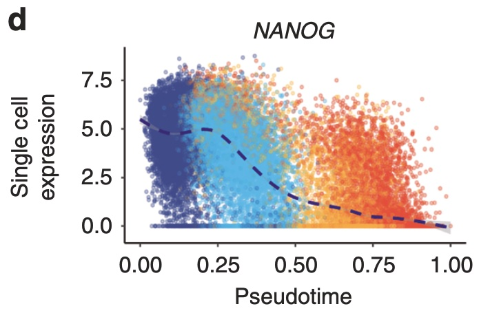
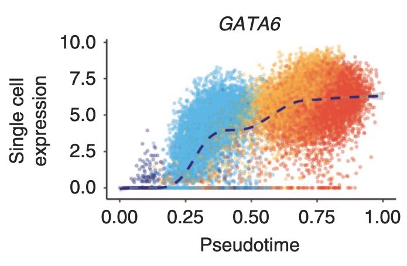

# Preamble: installation of R libraries

```{r}
# install BiocManager package if not installed yet.
# BiocManager is the package installer for Bioconductor software.
if (!requireNamespace("BiocManager", quietly = TRUE))
    install.packages("BiocManager")

# install packages if not yet installed.
pkgs <- c("SingleCellExperiment",
          "ExperimentHub",
          "edgeR",
          "biomaRt",
          "DropletUtils", 
          "scRNAseq", 
          "scater", 
          "scuttle", 
          "scran",
          "scry",
          "BiocSingular", 
          "scDblFinder",
          "Seurat",
          "PCAtools",
          "glmpca",
          "genefilter",
          "pheatmap",
          "tidyverse",
          "mclust",
          "ggplot2",
          "devtools",
          "SingleR")
notInstalled <- pkgs[!pkgs %in% installed.packages()[,1]]
if(length(notInstalled) > 0){
  BiocManager::install(notInstalled)
}
```

# install harmony from github

```{r}
library(devtools)
install_github("immunogenomics/harmony",
               dependencies = TRUE,
               force = TRUE)
```

# The Cuomo dataset

We here make use of the publication of Anna Cuomo et al.
(last author Oliver Stegle), which we will refer to as the `iPSC dataset`. The 
paper that describes this dataset can be found using this 
[link](https://www.nature.com/articles/s41467-020-14457-z).

In the experiment, the authors harvested induced pluripotent stem cells (iPSCs)
from 125 healthy human donors. These cells were used to study the endoderm 
differentiation process. In this process, iPSCs differentiate to endoderm cells,
a process which takes approximately three days. As such, the authors 
cultered the iPSCs cell lines and allowed for differentiation for three days. 
During the experiment, cells were harvested at four different time points: 
day0 (directly at to incubation), day1, day2 and day3. Knowing the process of 
endoderm differentiation, these time points should correspond with different 
cell types: day0 are (undifferentiated) iPSCs, day1 are mesendoderm cells, day2
are "intermediate" cells and day3 are fully differentiated endoderm cells.

This dataset was generated using the **SMART-Seq2** scRNA-seq protocol.

The final goal of the experiment was to characterize population variation in the
process of endoderm differentiation.

# Download data

For this lab session, we will work with a subset of the data, i.e., the data
for the first (alphabetically) 15 patients in the experiment. These are the
data you already downloaded for lab session 2 using the *belnet filesender* 
link.

The data original (125 patient) could be downloaded from 
[Zenodo](https://zenodo.org/record/3625024#.YWfahtlBxB1). At the bottom of this
web-page, we can download the files `raw_counts.csv.zip` and 
`cell_metadata_cols.tsv` and store these files locally. We do not recommend 
doing this during the lab session, to avoid overloading the system.

# Import data

First we read in the count matrix:

```{r, message=FALSE, warning=FALSE}
library(SingleCellExperiment)
sce <- readRDS("/Users/jg/Desktop/sce_15_cuomo.rds")
```

# Explore metadata

Exploration of the metadata is essential to get a better idea of what the
experiment was about and how it was organized.

```{r}
colData(sce)[1:5,1:10]
colnames(colData(sce))
```

As stated in the paper, cells were sampled on 4 time points. Each of these 
time points is expected to correspond with different cell types (day0 = iPSC,
day1 = mesendoderm, day2 = intermediate and day3 = endoderm).

```{r}
table(colData(sce)$day)
```

As stated in the paper, cells were harvested from 125 patients. Here, we are
working on a subset with 15 patients. The number of cells harvested per patient 
(over all time points) ranges from 31 to 637.

```{r}
length(table(colData(sce)$donor)) # number of donors
range(table(colData(sce)$donor)) # cells per donor
```

Below, we look how many cells are harvest per patent and per time point.

```{r}
table(colData(sce)$donor,colData(sce)$day)
```

We see that for many patients the data is complete, i.e. cells were sampled
on all time points.

Practically, the cells were prepared in 28 batches. Since we here only look
at a subset of the data, we see that only 14 of these batches are represented 
here.

```{r}
length(table(colData(sce)$experiment))
table(colData(sce)$experiment, colData(sce)$day)
```

# Obtaining and including rowData

The `rowData` slot of a `SingleCellExperiment` object allows for storing 
information on the features, i.e. the genes, in a dataset. In our object,
the `rowData` slot currently contains the following:

```{r}
head(rowData(sce))
```

To improve our gene-level information, we may:

1. Split `V1` into two columns, one with the ENSEMBL ID and the other with 
the gene symbol.

2. Display which chromosome the gene is located

Many more options are possible, but are not necessary for us right now.

```{r}
rowData(sce) <- data.frame(Ensembl = gsub("_.*", "", rowData(sce)$V1),
                           Symbol = gsub("^[^_]*_", "", rowData(sce)$V1))
head(rowData(sce))
```

```{r}
# currently issues with ensembl server -> do not evaluate this chunk
library("biomaRt")
ensembl75 <- useEnsembl(biomart = 'genes', 
                        dataset = 'hsapiens_gene_ensembl',
                        version = 75)

GeneInfo <- getBM(attributes = c("ensembl_gene_id", # To match with rownames SCE
                                 "chromosome_name"), # Info on chromose
                  mart = ensembl75)
GeneInfo <- GeneInfo[match(rowData(sce)$Ensembl, GeneInfo$ensembl_gene_id),]

rowData(sce) <- cbind(rowData(sce), GeneInfo)
head(rowData(sce))
all(rowData(sce)$Ensembl == rowData(sce)$ensembl_gene_id) 
# identical, as desired, so we could optionally remove one of the two
```

# Filtering non-informative genes

Let us first try the very simple and very lenient filtering criterion that we
adopted for the Macosko dataset.

```{r}
keep <- rowSums(assays(sce)$counts > 0) > 10
table(keep)
```

We see that this filtering strategy does not remove any genes for this dataset.
In general, datasets from plate-based scRNA-seq dataset have a far higher
sequencing depth than data from droplet-based protocols. As requiring a minimum
expression of 1 count in at least 10 cells is a very lenient criterion if we 
consider that we have 36.000 cells, we should consider adopting a more stringent
filtering criterium, like the `filterByExpr` from `edgeR`:

```{r, message=FALSE, warning=FALSE}
library(edgeR)

table(colData(sce)$day)

keep2 <- edgeR::filterByExpr(y=sce,
                             group = colData(sce)$day,
                             min.count = 5,
                             min.prop = 0.4)
table(keep2)
```

```{r}
sce <- sce[keep2,]
```

# Quality control

## Calculate QC variables

```{r}
library(scater)

# check ERCC spike-in transcripts
sum(grepl("^ERCC-", rowData(sce)$Symbol)) # no spike-in transcripts available

is.mito <- grepl("^MT", rowData(sce)$chromosome_name)
sum(is.mito) # 13 mitochondrial genes

df <- perCellQCMetrics(sce, subsets=list(Mito=is.mito))
head(df)

## add the QC variables to sce object
colData(sce) <- cbind(colData(sce), df)
```

## Exploratory data analysis

In the figure below, we see that several cells have a very low number of 
expressed genes, and where most of the molecules are derived from 
mitochondrial genes. This indicates likely damaged cells, presumably because 
of loss of cytoplasmic RNA from perforated cells, so we should remove these for 
the downstream analysis.

```{r}
# Number of genes vs library size
plotColData(sce, x = "sum", y="detected", colour_by="day") 

# Mitochondrial genes
plotColData(sce, x = "detected", y="subsets_Mito_percent", colour_by="day")
```

## QC using adaptive thresholds

Below, we remove cells that are outlying with respect to

 1. A low sequencing depth (number of UMIs);
 2. A low number of genes detected;
 3. A high percentage of reads from mitochondrial genes.
 
We remove a total of $301$ cells, mainly due to low sequencing depth and
low number of genes detected.

```{r}
lowLib <- isOutlier(df$sum, type="lower", log=TRUE)
lowFeatures <- isOutlier(df$detected, type="lower", log=TRUE)
highMito <- isOutlier(df$subsets_Mito_percent, type="higher")

table(lowLib)
table(lowFeatures)
table(highMito)

discardCells <- (lowLib | lowFeatures | highMito)
table(discardCells)
colData(sce)$discardCells <- discardCells

# visualize cells to be removed
plotColData(sce, x = "detected", y="subsets_Mito_percent", colour_by = "discardCells")
plotColData(sce, x = "sum", y="detected", colour_by="discardCells")
```

```{r}
# visualize cells to be removed
plotColData(sce, x = "detected", y="subsets_Mito_percent", colour_by = "donor")
plotColData(sce, x = "sum", y="detected", colour_by="donor")
```

```{r}
# visualize cells to be removed
plotColData(sce, x = "detected", y="subsets_Mito_percent", colour_by = "experiment")
plotColData(sce, x = "sum", y="detected", colour_by="experiment")
```

```{r}
table(sce$donor, sce$discardCells)
table(sce$donor, sce$discardCells)/rowSums(table(sce$donor, sce$discardCells))
#fractions of removed cells per donor
```

Most removed cells (fraction) are from patients `dixh` and `babz`.

```{r}
table(sce$experiment, sce$discardCells)
table(sce$experiment, sce$donor)
```

Most removed cells (fraction) are from patients `dixh` and `babz`.
Most low library sizes seem to come from patient `dixh`; for patient `babz`
the effect is less pronounced.

```{r}
plotColData(sce[,sce$donor=="dixh"], x = "sum", y="detected")
plotColData(sce[,sce$donor=="babz"], x = "sum", y="detected")
```

As such, we are mainly removing cells from specific patients and the respective
batches in which they were sequenced. However, we want to be careful; we only
want to remove technical artefacts, while retaining as much of the biology as
possible. In our exploratory figure, we see that the cells we are removing based
on the number of genes detected, are quite far apart from the bulk of the data
cloud; as such, these cells are indeed suspicious. For the criterion of
library size, we see that the cells removed there are still strongly connected
to the data cloud. As such, we may want to relax the filtering criterion there a
little bit. When we think of how the adaptive threshold strategy works, we
may want to remove cells that are 4MADs away from the center, rather than
the default 3 MADs.

```{r}
# previously
lowLib <- isOutlier(df$sum, type="lower", log=TRUE)
table(lowLib)

# after seeing appropriate exploratory figure
lowLib <- isOutlier(df$sum, nmads=4, type="lower", log=TRUE)
table(lowLib)

discardCells <- (lowLib | lowFeatures | highMito)
table(discardCells)
colData(sce)$discardCells <- discardCells
```

Note that these steps are not exact; different analysts will come with different
filtering criteria for many of the steps. The key ideas are that
we let appropriate exploratory figures guide us to make reasonable choices;
i.e., we look at the data rather than blindly following a standardized pipeline
that may work well in many cases, but maybe not our particular dataset.

```{r}
# remove cells identified using adaptive thresholds
sce <- sce[, !colData(sce)$discardCells]
```

# Normalization

For normalization, the size factors $s_i$ computed here are simply scaled 
library sizes:

\[ N_i = \sum_g Y_{gi} \]
\[ s_i = N_i / \bar{N}_i \]

```{r}
sce <- logNormCounts(sce)

# note we also returned log counts: see the additional logcounts assay.
sce

# you can extract size factors using
sf <- librarySizeFactors(sce)
mean(sf) # equal to 1 due to scaling.
plot(x= log(colSums(assays(sce)$counts)), 
     y=sf)
```

---

--- end lab session 1 ---

---


# Feature selection

## Highly variable genes

```{r}
library(scran)
rownames(sce) <- rowData(sce)$Ensembl
dec <- modelGeneVar(sce)
head(dec)
```

```{r}
fit <- metadata(dec)
plot(fit$mean, fit$var, 
     xlab="Mean of log-expression",
    ylab="Variance of log-expression")
curve(fit$trend(x), col="dodgerblue", add=TRUE, lwd=2)
```

```{r}
# get top 1000 highly variable genes
hvg <- getTopHVGs(dec, 
                  n=1000)
head(hvg)

# plot these 
plot(fit$mean, fit$var, 
     col = c("orange", "darkseagreen3")[(names(fit$mean) %in% hvg)+1],
     xlab="Mean of log-expression",
    ylab="Variance of log-expression")
curve(fit$trend(x), col="dodgerblue", add=TRUE, lwd=2)
legend("topleft", 
       legend = c("Selected", "Not selected"), 
       col = c("darkseagreen3", "orange"),
       pch = 16,
       bty='n')
```

# Dimensionality reduction

## Linear dimensionality reduction: PCA with feature selection

```{r}
set.seed(1234)
sce <- runPCA(sce, 
              ncomponents=30, 
              subset_row=hvg)
plotPCA(sce, 
        colour_by = "day")
```

PCA has been performed. The PCA information has been automatically stored in the
*reducedDim* slot of the SingleCellExperiment object.

```{r}
reducedDimNames(sce)
```

```{r}
head(reducedDim(sce,
           type="PCA"))
```

The `plotPCA` function of the `scater` package now allows us to visualize
the cells in PCA space, based on the PCA information stored in our object:

```{r}
plotPCA(sce, 
        colour_by = "day")
```

## A generalization of PCA for exponential family distributions.

```{r, eval=TRUE}
library(glmpca)
set.seed(211103)
poipca <- glmpca(Y = assays(sce)$counts[hvg,],
                 L = 2, 
                 fam = "poi",
                 minibatch = "stochastic")
reducedDim(sce, "PoiPCA") <- poipca$factors
plotReducedDim(sce, 
               dimred="PoiPCA",
               colour_by = "day")
```

## Non-linear dimensionality reduction: T-SNE

```{r}
set.seed(8778)
sce <- runTSNE(sce, 
               dimred = 'PCA',
               external_neighbors=TRUE)
plotTSNE(sce,
         colour_by = "day")
```

## Non-linear dimensionality reduction: UMAP

```{r, eval=FALSE}
set.seed(65187)

sce <- runPCA(sce, 
              ncomponents=30,
              subset_row=hvg)

sce <- runUMAP(sce, 
               dimred = 'PCA',
               pca = 12,
               external_neighbors = TRUE)
plotUMAP(sce,
         colour_by = "day")
plotUMAP(sce,
         colour_by = "donor")
plotUMAP(sce,
         colour_by = "experiment")
```

---

--- end lab session 2 ---

---

# Batch correction

## Observed patient/experiment effect

```{r}
table(sce$donor,sce$experiment)
```

```{r}
# target effect in PCA space, all time points
plotPCA(sce,
        colour_by = "day")
```

```{r}
# donor (nuisance) effect in PCA space, all time points
plotPCA(sce,
        colour_by = "donor")

# experiment (nuisance) effect in PCA space, all time points
plotPCA(sce,
        colour_by = "experiment")
```

```{r}
# donor effect in PCA space, per time point
plotPCA(sce[,sce$day=="day0"], 
        colour_by = "donor")
plotPCA(sce[,sce$day=="day1"], 
        colour_by = "donor")
plotPCA(sce[,sce$day=="day2"], 
        colour_by = "donor")
plotPCA(sce[,sce$day=="day3"], 
        colour_by = "donor")
```

```{r}
# nuisance effects in t-SNE space, all time points
plotTSNE(sce,
         colour_by = "donor")
plotTSNE(sce,
         colour_by = "experiment")
```

```
saveRDS(sce, "/Users/jg/Desktop/sce_after_prep.rds")
sce <- readRDS("/Users/jg/Desktop/sce_after_prep.rds")
```

## Seurat CCA batch correction

```{r, warning=FALSE, message=FALSE}
library(Seurat)
seurat_obj <- as.Seurat(sce)
seurat_obj
```

@Koen: When you ran the Seurat CCA algorithm, it was on the Cuomo dataset
without quality control. HEre, after quality control, we have 1 group with less
or equal than 30 cells. As a consequence, the `FindIntegrationAnchors` 
function breaks. It can be rescued by setting the `dims` argument lower, 
however, then the `IntegrateData` function may break. This all has been well
documented in the following GitHub issues:

- https://github.com/satijalab/seurat/issues/3930
- https://github.com/satijalab/seurat/issues/4803
- https://github.com/satijalab/seurat/issues/4812
- https://github.com/carmonalab/STACAS/issues/12

The bottom line of the responses from the maintainers is that CCA should not be
used with small batches, e.g., less than 30 or even 100 cells. They suggest
either merging such small batches with other batches, or removing the small
batches altogether. They actually seem to favor the latter, do that is what I
will be doing here.

```{r}
table(seurat_obj$donor)
table(seurat_obj$donor)[table(seurat_obj$donor) <= 30]
seurat_obj <- seurat_obj[,-which(seurat_obj$donor == names(table(seurat_obj$donor)[table(seurat_obj$donor) <= 30]))]
```

```{r}
seurat_obj.list <- SplitObject(seurat_obj, split.by = "donor")
nlevels(as.factor(sce$donor)) # originally 15 patients
length(seurat_obj.list) # 14 patients left
```

```{r}
# normalize and identify variable features for each dataset (patient) independently
seurat_obj.list <- lapply(X = seurat_obj.list, FUN = function(x) {
    x <- NormalizeData(x,verbose = FALSE)
    x <- FindVariableFeatures(x, 
                              selection.method = "vst", 
                              nfeatures = 1000,
                              verbose = FALSE)
})

# select features that are repeatedly variable across datasets for integration
features <- SelectIntegrationFeatures(object.list = seurat_obj.list)
```

```{r, warning=FALSE, message=FALSE}
anchors <- FindIntegrationAnchors(object.list = seurat_obj.list, 
                                  anchor.features = features,
                                  verbose = FALSE)
```

```{r}
# this command creates an 'integrated' data assay
data.combined <- IntegrateData(anchorset = anchors,
                               k.weight = 30,
                               verbose=FALSE)
```


```{r}
# Run the standard Seurat workflow for visualization and clustering
data.combined <- ScaleData(object = data.combined, 
                           verbose = FALSE)

data.combined <- RunPCA(object = data.combined, 
                        npcs = 30,
                        reduction.name = "PCA_SeuBatch",
                        verbose = FALSE)

# data.combined <- RunUMAP(object = data.combined, 
#                          reduction = "pca", 
#                          dims = 1:12, 
#                          min.dist=0.4,
#                          n.neighbors=15,
#                          verbose = FALSE)

data.combined <- RunTSNE(object = data.combined, 
                         reduction = "PCA_SeuBatch",
                         reduction.name = "tSNE_SeuBatch",
                         dims = 1:12)
```

```{r}
data.combined <- FindNeighbors(object = data.combined, 
                               reduction = "PCA_SeuBatch", 
                               dims = 1:12,
                               verbose = FALSE)
data.combined <- FindClusters(object = data.combined, 
                              resolution = 0.5,
                              verbose = FALSE)

# t-SNE visualization
p1 <- DimPlot(object = data.combined, 
              reduction = "tSNE_SeuBatch", 
              group.by = "donor")
p2 <- DimPlot(object = data.combined, 
              reduction = "tSNE_SeuBatch", 
              group.by = "day")
p1 + p2
```

Visualize using Bioconductor functions

```{r}
sce_intSeurat <- as.SingleCellExperiment(data.combined)

# without Seurat batch correction
p1 <- plotTSNE(sce,
               colour_by = "day")
p2 <- plotTSNE(sce,
               colour_by = "donor")
p1 + p2

# with Seurat batch correction


```
## Harmony batch correction

```{r}
library(harmony)

set.seed(684864)
sce <- harmony::RunHarmony(object = sce, 
                        group.by.vars	= c("donor", "experiment"),
                        reduction = "PCA",
                        reduction.save = "HARMONY_donor_experiment",
                        verbose = FALSE)
```

```{r}
reducedDim(sce,type="PCA")[1:5,1:2]
reducedDim(sce,type="HARMONY_donor_experiment")[1:5,1:2]
```

```{r}
ggplot(data = as.data.frame(reducedDim(sce,type="PCA")[,1:2]), 
       aes(x=PC1,y=PC2)) +
  geom_point(aes(colour = as.factor(sce$day))) +
  theme_bw()

ggplot(data = as.data.frame(reducedDim(sce,type="HARMONY_donor_experiment")[,1:2]), 
       aes(x=HARMONY_donor_experiment_1,y=HARMONY_donor_experiment_2)) +
  geom_point(aes(colour = as.factor(sce$day))) +
  theme_bw()
```

```{r,fig.height=20, fig.width=7}
ggplot(data = as.data.frame(reducedDim(sce,type="PCA")[,1:2]), 
       aes(x=PC1,y=PC2)) +
  geom_point(aes(colour = as.factor(sce$donor))) +
  theme_bw() +
  theme(legend.title = element_blank()) +
  facet_wrap(~as.factor(sce$day), scales="free", ncol=1)
```

```{r,fig.height=20, fig.width=7}
ggplot(data = as.data.frame(reducedDim(sce,type="HARMONY_donor_experiment")[,1:2]), 
       aes(x=HARMONY_donor_experiment_1, y=HARMONY_donor_experiment_2)) +
  geom_point(aes(colour = as.factor(sce$donor))) +
  theme_bw() +
  theme(legend.title = element_blank()) +
  facet_wrap(~as.factor(sce$day), scales="free", ncol=1)
```

```{r}
sce <- runTSNE(sce, 
               dimred = 'HARMONY_donor_experiment',
               external_neighbors=TRUE,
               name = "TSNE_HARMONY_donor_experiment")
```

```{r}
# no batch versus batch corrected, color by day
p1 <- plotReducedDim(sce,
                     dimred = "TSNE",
                     colour_by = "day")

p2 <- plotReducedDim(sce,
                     dimred = "TSNE_HARMONY_donor_experiment",
                     colour_by = "day")
p1 + p2

# no batch versus batch corrected, color by donor
p3 <- plotReducedDim(sce,
                     dimred = "TSNE",
                     colour_by = "donor")

p4 <- plotReducedDim(sce,
                     dimred = "TSNE_HARMONY_donor_experiment",
                     colour_by = "donor")
p3 + p4

# no batch versus batch corrected, color by experiment
p5 <- plotReducedDim(sce,
                     dimred = "TSNE",
                     colour_by = "experiment")

p6 <- plotReducedDim(sce,
                     dimred = "TSNE_HARMONY_donor_experiment",
                     colour_by = "experiment")
p5 + p6
```

```
saveRDS(sce, "/Users/jg/Desktop/sce_after_batch.rds")
```

# Clustering

## Hierarchical clustering

We may split the process in two more intuitive steps:

1. Compute the pairwise distances between all cells. These are by default
euclidean distances and, in order to reduce data complexity and increase signal
to noise, we may perform this on the top (30) PC's. Implemented in the `dist`
function.

2. This function performs a hierarchical cluster analysis the distances from 
step1. Initially, each cell is assigned to its own cluster and then the 
algorithm proceeds iteratively, at each stage joining the two most similar 
clusters, continuing until there is just a single cluster. Implemented in the
`hclust` function.

Note that the `hclust` function allows for specifying a "method" argument.
The differences between the different methods goes beyond the scope of this
session, but a brief description is provided in the function help file.
In the context of scRNA-seq, I have mostly seen the use of the "ward.D2"
method.

```{r}
distsce <- dist(reducedDim(sce, "HARMONY_donor_experiment"))
hcl <- hclust(distsce, method = "ward.D2")
plot(hcl, labels = FALSE)
```

Next, we need to "cut the tree", i.e., choose at which resolution we want to
report the (cell-type) clusters. This can be achieved with the `cutree` 
function. As an input, `cutree` takes the dendrogram from the `hclust` function
and a threshold value for cutting the tree. This is either `k`, the number of
clusters we want to report, or `h`, the height in the dendrogram at which
we wan to cut the tree.

```{r}
clust_hcl_k4 <- cutree(hcl, k = 4)
table(clust_hcl_k4)
```

```{r}
sce$clust_hcl_k4 <- as.factor(clust_hcl_k4)

plotReducedDim(sce,
        dimred = "HARMONY_donor_experiment",
        colour_by="clust_hcl_k4")
plotReducedDim(sce, 
        dimred = "HARMONY_donor_experiment",
         colour_by ="day")
```

# Trajectory inference

[Wikipedia](https://en.wikipedia.org/wiki/Trajectory_inference)
provides a decent high-level description of this trajectory inference: 

"Trajectory inference or pseudotemporal ordering is a computational technique 
used in single-cell transcriptomics to determine the pattern of a dynamic 
process experienced by cells and then arrange cells based on their progression 
through the process. [...] Trajectory inference seeks to characterize [such] 
differences by placing cells along a continuous path that represents the 
evolution of the process rather than dividing cells into discrete clusters.
In some methods this is done by projecting cells onto an axis called pseudotime 
which represents the progression through the process."

## Computing the trajectory

Here, we will use 
[slingshot](https://bioconductor.org/packages/release/bioc/html/slingshot.html) 
to create a trajectory for the Cuomo dataset.

```{r}
library(slingshot)
sce <- slingshot(sce,
                 start.clus = "2",
                 end.clus = "3",
                 clusterLabels = "clust_hcl_k4", 
                 reducedDim = "HARMONY_donor_experiment")
```

## Visualizing the trajectory

```{r}
plot(reducedDims(sce)$HARMONY_donor_experiment[,c(1,2)], 
     col = as.factor(sce$clust_hcl_k4),
     pch=16, 
     asp = 1)
lines(SlingshotDataSet(sce), 
      lwd=2, 
      type = 'lineages', 
      col = 'black')
```

```{r}
plot(reducedDims(sce)$HARMONY_donor_experiment, 
     col = as.factor(sce$day), 
     pch=16, 
     asp = 1)
lines(SlingshotDataSet(sce), 
      lwd=2, 
      type = 'lineages', 
      col = 'black')
```

## Differential gene expression tests along a trajectory using tradeSeq

```{r}
library(tradeSeq)
```

```
### Find knots

# We first need to decide on the number of knots. This is done using the  -->
# `evaluateK` function. This takes a little time. -->

# takes 9min for me
set.seed(5)
icMat <- evaluateK(counts = assays(sce)$counts,
                   sds = sling$slingshot,
                   k = 3:10, 
                   nGenes = 500, 
                   verbose = T)
```

### Fit GAM

```{r}
set.seed(7)
subset_genes <- sample(rownames(sce), 1000, replace = FALSE)

# genes from paper
markers <- c("ENSG00000111704", "ENSG00000164458", "ENSG00000141448")

# make sure the genes from the paper are in there
subset_genes <- c(subset_genes, markers[!markers %in% subset_genes])

#20min for all genes, ±2min30 for 1000 genes
pseudotime <- slingPseudotime(sce, na = FALSE)
cellWeights <- slingCurveWeights(sce)

sce_fit <- fitGAM(counts = assays(sce)$counts[subset_genes,], 
                       pseudotime = pseudotime, 
                       cellWeights = cellWeights,
                       nknots = 6, 
                       verbose = TRUE)
```

```{r}
table(rowData(sce_fit)$tradeSeq$converged)
```

### Association test

```{r}
# ±20sec
assoRes <- associationTest(sce_fit)
head(assoRes)
```

```{r}
sum(p.adjust(assoRes$pvalue, method = "BH") < 0.05, na.rm=T)/nrow(assoRes) 
# @Koen ±90% significant (?)
```

### Start vs end top 20

```{r}
startRes <- startVsEndTest(sce_fit)
```

```{r}
oStart <- order(startRes$waldStat, decreasing = TRUE)
for (i in 1:5) {
  sigGeneStart <- oStart[i] # top 5 most significant genes in the start vs. end test
  print(plotSmoothers(sce_fit, 
                assays(sce_fit)$counts, 
                gene = sigGeneStart) +
          ggtitle(rownames(sce)[sigGeneStart]))
}
```

### Comparison to original paper

In the Cuomo paper, the authors highlighted the following genes:

```{r}
plotSmoothers(sce_fit, 
              assays(sce_fit)$counts, 
              gene = which(rownames(sce_fit) == "ENSG00000111704"))

plotSmoothers(sce_fit, 
              assays(sce_fit)$counts, 
              gene = which(rownames(sce_fit) == "ENSG00000164458"))

plotSmoothers(sce_fit, 
              assays(sce_fit)$counts, 
              gene = which(rownames(sce_fit) == "ENSG00000141448"))

```

**A very nice correspondence with the results presented in the paper!!**

```{r}

knitr::include_graphics("./../cuomo_traj2.jpeg")

```

```{r}
plotGeneCount(sce$slingshot, 
              assays(sce_fit)$counts, 
              gene = which(rownames(sce_fit) == "ENSG00000111704"))
              
plotGeneCount(sce$slingshot, 
              assays(sce_fit)$counts, 
              gene = which(rownames(sce_fit) == "ENSG00000164458"))

plotGeneCount(sce$slingshot, 
              assays(sce_fit)$counts, 
              gene = which(rownames(sce_fit) == "ENSG00000141448"))
```


