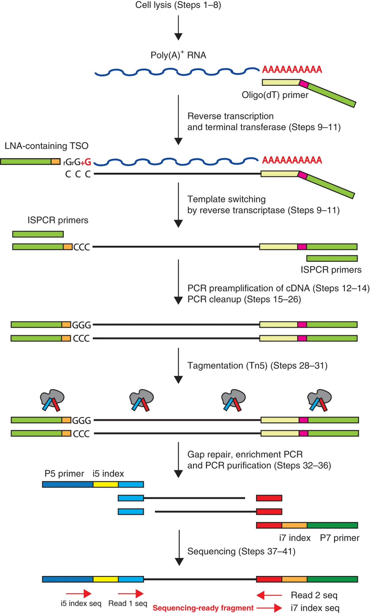
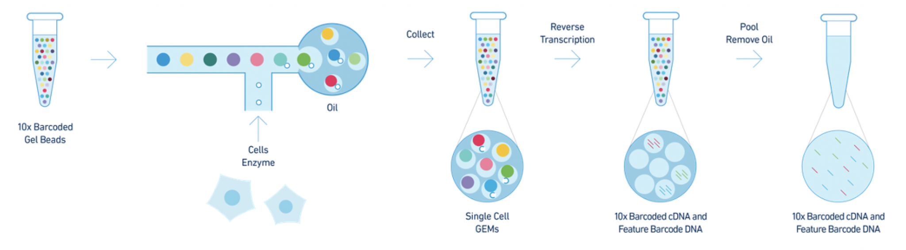
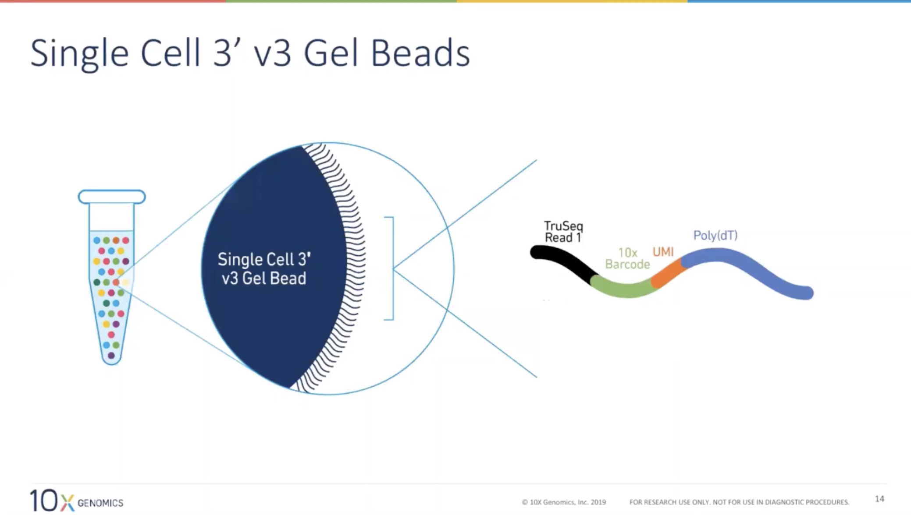
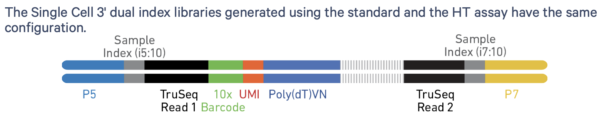

```{r functions, include=FALSE}
# A function for captioning and referencing images
fig <- local({
    i <- 0
    ref <- list()
    list(
        cap=function(refName, text) {
            i <<- i + 1
            ref[[refName]] <<- i
            paste("Figure ", i, ": ", text, sep="")
        },
        ref=function(refName) {
            ref[[refName]]
        })
})
``` 

```{r, echo=FALSE, eval=TRUE}
suppressPackageStartupMessages({
  library(knitr)
  library(rmarkdown)
  library(ggplot2)
})
```

# The Smart-seq2 protocol

1. First, the biological **samples of interest are collected**, and cells should be disaggregated into a single-cell suspension.
2. Cells are picked from the suspension and embedded in a **lysis** buffer containing a ribonuclease inhibitor that blocks RNA degradation, and primers for the reverse transcription step. 
3. **Reverse transcription**. Single-stranded RNA molecules are converted into more stable double-stranded cDNA molecules. 
4. The cDNA molecules are amplified using **PCR amplification**.
5. Construction of sequencing libraries using **tagmentation**. A transposase is used to **fragment** the cDNA molecules and simultaneously **ligate adapter sequences**.
6. Another cycle of PCR occurs (the enrichment PCR step). Sample barcodes may be added to allow multiplexing; a dual-index strategy is often used, indices referred to as index 1 (i7) and index 2 (i5) in the Figure below.

```{r, echo=FALSE, fig.cap=paste("Figure: The SMART-Seq2 library prep workflow. Image from [Picelli *et al.* (2014)](https://www.nature.com/articles/nprot.2014.006).")}

```

# The 10X Genomics Chromium protocol

- The 10X Genonics Chromium protocol is droplet-based, i.e., cells are embedded into nanodroplets within which library preparation steps occur.
- Within each droplet, gel beads along with reagents are encapsulated together with the cell.
- These gel beads contain millions of sequences on their surface. These sequences consist of a sequencing adapter ('TruSeq Read'), cell barcode ('10X Barcode'), molecular barcode ('UMI'), and a Poly(dT) to capture polyA'd mRNAs. As of v3, two additional capture sequences may be used for capturing additional molecules, e.g., guide RNAs.
- The beads are mixed with the cells of our sample, which are then emulated within oil to create nanodroplets. See 'Getting Started with Single Cell Gene Expression' video at 10:40 on the [10X Genomics website](https://www.10xgenomics.com/products/single-cell-gene-expression) for a demonstration. These droplets are often called **GEMs**, for 'Gel beads in EMulsion'.
- Within these GEMs, the necessary library preparation steps occur, and the produced molecules each contain a cell barcode as well as a Unique Molecular Identifier (UMI), which may then be sequenced.

```{r, echo=FALSE, fig.cap=paste("Figure: The 10X Genomics Chromium protocol. Images from 10X Genomics.")}



```
